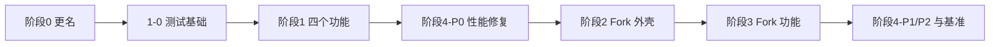

# AweGit 执行计划：全量更名 + 一比一还原 Fork + 大仓库性能

> 依据 main@c2c37c71 源码逐项核对。行号以该提交为准，前面的改动会让行号漂移，定位时以函数名和代码片段为准。
> 与旧计划的主要差异：包名 `com.zhoujun.awegit`；仓库目前没有任何测试源码，要先搭测试基础；`TaskType` 是 sealed interface，`ErrorDialog.errorTitle()` 的 `when` 没有 `else`；标签页本来就是懒打开；Windows 上提交信息草稿会触发整库刷新（性能 P0）。

## 任务清单

- [ ] 0a 代码批量更名
- [ ] 0b 数据目录与旧数据迁移
- [ ] 0c 品牌、法律声明、图标与发布
- [ ] 1-0 测试基础设施
- [ ] 1a Fork 风格 Pull 对话框
- [ ] 1b 修改未推送提交的描述
- [ ] 1c AI 生成提交描述
- [ ] 1d 工作区（Workspaces）
- [ ] 4-P0 性能修复（提前做）
- [ ] 2a 设计令牌与基础控件
- [ ] 2b 对话框
- [ ] 2c 主布局、工具栏、标签栏、快捷键
- [ ] 2d 侧边栏
- [ ] 2e 提交列表
- [ ] 2f 提交详情、本地改动、Diff
- [ ] 3a Quick Launch
- [ ] 3b 分支可见性与多选提交
- [ ] 3c 冲突解决器与交互式 Rebase
- [ ] 3d Git Flow 与 Worktrees
- [ ] 3e 自定义命令、补丁、仓库设置、Reflog、统计
- [ ] 4-P1/P2 与基准

---

## 0. 执行约定（先读）

### 0.1 路径简写（阶段 0 完成后生效）

- `[app]` = `app/src/main/kotlin/com/zhoujun/awegit`
- `[domain]` = `domain/src/main/kotlin/com/zhoujun/awegit/domain`
- `[data]` = `data/src/main/kotlin/com/zhoujun/awegit/data`
- `[common]` = `common/src/main/kotlin/com/zhoujun/awegit/common`
- `[res]` = `app/src/main/composeResources`
- `[domain-test]` = `domain/src/test/kotlin/com/zhoujun/awegit/domain`
- `[data-test]` = `data/src/test/kotlin/com/zhoujun/awegit/data`
- 阶段 0 之前这些目录在 `com/jetpackduba/gitnuro` 下。

### 0.2 执行顺序



### 0.3 命令（Windows PowerShell）

- 生成 Rust 绑定（首次、改过 `rs/` 后必须）：`.\gradlew.bat :app:rustTasks`
- 编译：`.\gradlew.bat :app:compileKotlin`
- 测试：`.\gradlew.bat :domain:test :data:test`
- 运行：`.\gradlew.bat run`
- 每个任务完成：测试和运行冒烟通过 → `git status` 确认只有本任务的文件 → `git add <文件>` → `git commit -m "type: 描述"`（按 AGENTS.md）

### 0.4 通用做法清单（后文反复引用）

**A. 新增 GitAction**

1. `[domain]/interfaces/IXxxGitAction.kt`：

```kotlin
interface IXxxGitAction {
    suspend operator fun invoke(repositoryPath: String /* , 其他参数 */): Either<ResultType, GitError>
}
```

2. `[data]/git/<分类>/XxxGitAction.kt`：

```kotlin
class XxxGitAction @Inject constructor(private val jgit: JGit) : IXxxGitAction {
    override suspend fun invoke(repositoryPath: String) = withContext(Dispatchers.IO) {
        jgit.provide(repositoryPath) { git ->
            // JGit 调用；抛出的异常会被 JGit.provide 转成 GenericError
        }
    }
}
```

3. `[app]/di/modules/TabScopeGitActionsModule.kt` 追加：

```kotlin
@Binds
@TabScope
fun bindsXxxGitAction(action: XxxGitAction): IXxxGitAction
```

**B. 新增 UseCase**：`class XxxUseCase @Inject constructor(...)`。需要进度和通知的操作：

```kotlin
operator fun invoke(/* ... */): Job = useCaseExecutor.executeLaunch(
    taskType = TaskType.Xxx,
    dataToRefresh = arrayOf(DataToRefresh.XXX),
) { repositoryPath ->
    val value = someGitAction(repositoryPath).bind()     // 失败自动短路
    if (bad) raiseError(GenericError("..."))
    Either.Ok(Unit)
}
```

UseCase 之间不要互相调用 `executeLaunch`（会各开一个任务），需要复用就直接调 GitAction。

**C. 新增 TaskType（4 处，漏第 3 处会编译失败）**

1. `[domain]/models/TaskType.kt`：照 `RevertCommit` 的写法加 `data object Xxx : TaskType`
2. `[domain]/models/NotificationData.kt` 的 `TaskType.successTitle()`：要成功提示就加分支，否则落到 `else -> null`
3. `[app]/ui/dialogs/errors/ErrorDialog.kt` 的 `TaskType.errorTitle()`：必须加分支
4. `[app]/ProcessingScreen.kt` 的 `getTitle()`：加分支（后台任务返回 `""`）

**D. 新增对话框**

1. `[app]/App.kt` 的 `sealed interface Screen : NavKey`（69–92 行）末尾加 `data class Xxx(val arg: T) : Screen`（无参用 `data object`）
2. ViewModel 放 `[app]/ui/dialogs/XxxViewModel.kt`：

```kotlin
class XxxViewModel @AssistedInject constructor(
    private val someUseCase: SomeUseCase,
    @Assisted private val arg: T,
) : TabViewModel() {
    @AssistedFactory
    interface Factory {
        fun create(arg: T): XxxViewModel
    }
}
```

3. `[app]/di/TabComponent.kt` 加 `fun xxxViewModelFactory(): XxxViewModel.Factory`
4. `[app]/ui/AppTab.kt` 的 `entryProvider { }` 里，照 `entry<Screen.BranchChangeUpstream>`（196–206 行）加：

```kotlin
entry<Screen.Xxx>(metadata = dialogsMetadata) { entry ->
    XxxDialog(
        viewModel = tabViewModel(entry) { it.xxxViewModelFactory().create(entry.arg) },
        onDismiss = { backStack.removeLastOrNull() },
    )
}
```

5. 打开：在有 `onNavigate` 的地方调用 `onNavigate(Screen.Xxx(...))`
6. 注意：对话框关闭时，`tabViewModel` 会调用 `onClear()`，取消 `viewModelScope` 里的协程。点主按钮后要立刻关闭的操作必须交给 UseCase（它跑在 `TabCoroutineScope`），需要持久化的选项在切换时立即保存。

**E. 新增设置项**（模板：`SwapStatusPanes`）

1. `[domain]/models/AppConfig.kt`：`data class Xxx(val value: T) : AppConfig`
2. `[domain]/repositories/AppSettingsRepository.kt`：`val xxx: Flow<T?>`
3. `[data]/repositories/configuration/DataStoreAppSettingsRepository.kt`：
   - 顶部 `private val xxxPreference get() = booleanPreferencesKey("xxx")`
   - 属性 `override val xxx = preferences.data[xxxPreference]`
   - `setConfiguration` 的 `when`（137–169 行）加 `is AppConfig.Xxx -> setValue(xxxPreference, appConfig.value)`
4. `[domain]/services/AppSettingsService.kt`：`val xxx: Flow<T> get() = appSettingsRepository.xxx.defaultIfNull { DEFAULT_XXX }`，companion 加常量
5. 要在设置页显示：
   - `[app]/viewmodels/SettingsViewModel.kt` 的 `combine`（现有 25 个，上限 30）、lambda 参数、`SettingsViewState` 字段、`emptySettingsState()` 各加一处
   - `[app]/ui/dialogs/settings/SettingsDialog.kt` 里加一行，`onValueChanged` 发 `SettingsAction.SetConfig(AppConfig.Xxx(it))`

**F. 新增错误类型**：写进 `[domain]/errors/AppError.kt`（sealed，必须同文件同包），并在 `[app]/ui/Errors.kt` 的 `getErrorText()` 里加分支。

**G. 线程**：JGit、文件、网络操作都放 `Dispatchers.IO`。`TabCoroutineScope` 是 `SupervisorJob() + Dispatchers.Default`。

**H. 文案**：对话框和设置行沿用现有写法（英文硬编码）；右键菜单、提交区等已经用 `stringResource` 的地方，在 `[res]/values/strings.xml` 加 key。界面保持英文，与 Fork 一致。

---

## 阶段 0：全量更名为 AweGit（包名 `com.zhoujun.awegit`）

盘点结果：
- 792 个受跟踪文件，645 个 `.kt` 全在 `com/jetpackduba/gitnuro` 下
- `Abdelilah` 和 `gitnuro.com` 只出现在 `gitnuro.iss`
- 没有 Flatpak、`.desktop`、`Info.plist`
- `.ttf` 走 Git LFS，脚本不会碰

### 0a 代码批量更名

前置：
1. `git status` 干净
2. 基线：`.\gradlew.bat :app:compileKotlin` 成功，记下耗时。失败先停，不要开始更名

步骤 1：在仓库根目录执行（PowerShell 5.1 和 7 都可以）：

```powershell
$ErrorActionPreference = 'Stop'
Set-Location D:\MyGit\Gitnuro

# 1. 移动 Kotlin 源码根（autogenerated 等被忽略的文件会跟着目录一起移动）
foreach ($m in 'app', 'domain', 'data', 'common') {
    $old = "$m/src/main/kotlin/com/jetpackduba/gitnuro"
    if (Test-Path $old) {
        New-Item -ItemType Directory -Force "$m/src/main/kotlin/com/zhoujun" | Out-Null
        git mv $old "$m/src/main/kotlin/com/zhoujun/awegit"
    }
    $left = "$m/src/main/kotlin/com/jetpackduba"
    if ((Test-Path $left) -and -not (Get-ChildItem -Force -Recurse $left)) { Remove-Item $left -Force }
}

# 2. 其他目录和文件
New-Item -ItemType Directory -Force rs/bindings/com/zhoujun | Out-Null
git mv rs/bindings/com/jetpackduba/gitnuro rs/bindings/com/zhoujun/awegit
if (-not (Get-ChildItem -Force -Recurse rs/bindings/com/jetpackduba)) { Remove-Item rs/bindings/com/jetpackduba -Force }
git mv app/src/main/resources/META-INF/native-image/gitnuro app/src/main/resources/META-INF/native-image/awegit
git mv gitnuro.iss awegit.iss
git mv domain/src/main/kotlin/com/zhoujun/awegit/domain/exceptions/GitnuroException.kt domain/src/main/kotlin/com/zhoujun/awegit/domain/exceptions/AweGitException.kt

# 3. 文本替换：大小写敏感、按顺序、UTF-8 无 BOM、保留原换行
$pairs = [ordered]@{
    'com.jetpackduba.gitnuro' = 'com.zhoujun.awegit'
    'com/jetpackduba/gitnuro' = 'com/zhoujun/awegit'
    'GitnuroException'        = 'AweGitException'
    'gitnuro_rs'              = 'awegit_rs'
    'gitnuro-rs'              = 'awegit-rs'
    'GitnuroRs'               = 'AweGitRs'
    'gitnuroRs'               = 'aweGitRs'
}
$textExt = '.kt', '.kts', '.toml', '.json', '.yml', '.yaml', '.md', '.xml', '.iss', '.pro', '.properties', '.rs', '.gitignore'
$utf8 = New-Object System.Text.UTF8Encoding($false)
$changed = 0
foreach ($f in (git ls-files)) {
    if ($textExt -notcontains [IO.Path]::GetExtension($f)) { continue }
    $full = (Resolve-Path $f).Path
    $text = [IO.File]::ReadAllText($full)
    $new = $text
    foreach ($k in $pairs.Keys) { $new = $new.Replace($k, $pairs[$k]) }
    if ($new -ne $text) { [IO.File]::WriteAllText($full, $new, $utf8); $changed++ }
}
"changed: $changed"
```

脚本会顺带改好：
- 645 个文件的 package 和 import
- Compose 资源包名 `com.zhoujun.awegit.app.generated.resources`
- `reachability-metadata.json`
- `rs/uniffi.toml` 的包名，`rs/Cargo.toml` 的 crate 名和库名
- `app/build.gradle.kts` 的 `packageName`、`mainClass`、UniFFI 路径、`libName`
- `.gitignore:19`
- `App.kt` 的原生库文件名和变量名
- `AGENTS.md:26`

步骤 2：手工修改
1. `settings.gradle.kts:27` → `rootProject.name = "AweGit"`
2. `app/build.gradle.kts`：
   - 25 行 `val projectName = "AweGit"`
   - 166–169 行，macOS 有证书才签名：`sign.set(System.getenv("SIGNING_IDENTITY") != null)`
   - 243 行 `generateKotlinSources()` 里 `file.delete()` 改为 `file.deleteRecursively()`（否则旧绑定的子目录删不掉）
   - 确认 32、143、195、367–371 行已被脚本改成新名字
3. `rs/Cargo.toml`：`[package]` 加 `authors = ["ZhouJun"]`；`libssh-rs`、`libssh-rs-sys`、`kotars` 三个 `JetpackDuba/...` 的 git 依赖保持不变（它们是第三方库）

步骤 3：清理旧生成物

```powershell
Get-ChildItem domain/src/main/kotlin/com/zhoujun/awegit/autogenerated -Force | Where-Object Name -ne '.gitignore' | Remove-Item -Recurse -Force
Get-ChildItem app/src/main/resources -Filter '*gitnuro_rs*' -ErrorAction SilentlyContinue | Remove-Item -Force
```

步骤 4：构建

```powershell
.\gradlew.bat :app:rustTasks
Get-ChildItem -Recurse domain/src/main/kotlin/com/zhoujun/awegit/autogenerated   # 应只有 .gitignore 和包名为 com.zhoujun.awegit 的 awegit_rs.kt
.\gradlew.bat :app:compileKotlin
.\gradlew.bat run
```

验收：编译通过，应用能启动、能打开仓库。数据目录和界面文案此时还是旧的，由 0b、0c 处理。

提交：`refactor: 包名改为 com.zhoujun.awegit，Rust 库改名 awegit_rs`

### 0b 数据目录与旧数据迁移

现状（都要改）：
- DataStore：`DataStoreAppSettingsRepository.kt:238-261` 的 `getPreferencesPath()`，Windows 上实际是 `%USERPROFILE%\gitnuro\user_prefs.preferences_pb`
- Java Preferences 节点：同文件 22 行 `PREFERENCES_NAME = "GitnuroConfig"`，存标签页、最近仓库、面板宽度。Windows 上在注册表；Linux 上由 `initPreferencesPath()`（222–235 行）设到 `~/.config/gitnuro`
- 日志：`[app]/LogsRepository.kt:50-89`
- 临时目录：`[domain]/TempFilesManager.kt` 的 `AppFilesManager`（macOS 路径还少了 ` Support`）
- 仓库内配置：`[data]/git/config/LocalConfigConstants.kt:4` 的 `"gitnuro"`，写在 `.git/gitnuro`，存 sign-off 配置

步骤：

1. 新建 `[common]/AppDirectories.kt`：

```kotlin
package com.zhoujun.awegit.common

import java.io.File

object AppDirectories {
    const val APP_DIR_NAME = "awegit"
    const val LEGACY_APP_DIR_NAME = "gitnuro"
    const val PREFERENCES_FILE_NAME = "user_prefs.preferences_pb"

    private val home: String get() = System.getProperty("user.home").orEmpty()

    private fun configBase(): File = when (currentOs) {
        OS.LINUX -> File(System.getenv("XDG_CONFIG_HOME").takeUnless { it.isNullOrBlank() } ?: "$home/.config")
        OS.MAC -> File(home, "Library/Application Support")
        OS.WINDOWS -> File(System.getenv("APPDATA").takeUnless { it.isNullOrBlank() } ?: "$home/AppData/Roaming")
        else -> File(home)
    }

    /** 设置、workspaces.json、缓存、tmp、原生库 */
    fun configDir(): File = File(configBase(), APP_DIR_NAME).apply { mkdirs() }

    fun logsDir(): File = when (currentOs) {
        OS.LINUX -> File(System.getenv("XDG_STATE_HOME").takeUnless { it.isNullOrBlank() } ?: "$home/.local/state", "$APP_DIR_NAME/logs")
        OS.MAC -> File(home, "Library/Logs/com.zhoujun.awegit")
        OS.WINDOWS -> File(System.getenv("LOCALAPPDATA").takeUnless { it.isNullOrBlank() } ?: "$home/AppData/Local", "AweGit/logs")
        else -> File(home, "$APP_DIR_NAME/logs")
    }.apply { mkdirs() }

    fun preferencesFile(): File = File(configDir(), PREFERENCES_FILE_NAME)

    private fun legacyConfigDirs(): List<File> = when (currentOs) {
        OS.LINUX -> listOfNotNull(
            System.getenv("XDG_CONFIG_HOME")?.takeIf { it.isNotBlank() }?.let { File(it, LEGACY_APP_DIR_NAME) },
            File(home, ".config/$LEGACY_APP_DIR_NAME"),
        )
        OS.MAC -> listOf(File(home, "Library/Application Support/$LEGACY_APP_DIR_NAME"))
        else -> listOf(File(home, LEGACY_APP_DIR_NAME))
    }

    /** 新位置没有数据时，从 Gitnuro 的位置复制一次；旧数据不删除 */
    fun migrateLegacyFilesIfNeeded() {
        val target = preferencesFile()
        if (!target.exists()) {
            legacyConfigDirs().map { File(it, PREFERENCES_FILE_NAME) }.firstOrNull { it.exists() }?.copyTo(target)
        }
        if (currentOs == OS.LINUX) {
            // FileSystemPreferences 存在 <userRoot>/.java/.userPrefs
            val newJava = File(configDir(), ".java")
            val oldJava = legacyConfigDirs().map { File(it, ".java") }.firstOrNull { it.exists() }
            if (!newJava.exists() && oldJava != null) oldJava.copyRecursively(newJava)
        }
    }
}
```

2. `DataStoreAppSettingsRepository.kt`：
   - 22 行改为 `private const val PREFERENCES_NAME = "AweGitConfig"`，下一行加 `private const val LEGACY_PREFERENCES_NAME = "GitnuroConfig"`
   - `initPreferencesPath()` 函数体改为：`if (currentOs == OS.LINUX) System.setProperty("java.util.prefs.userRoot", AppDirectories.configDir().absolutePath)`
   - `getPreferencesPath()` 函数体改为 `return AppDirectories.preferencesFile().absolutePath`，删掉 237 行的 TODO
   - 新增顶层函数（`LegacyPreferences` 是该文件里 `java.util.prefs.Preferences` 的别名，照现有 import）：

```kotlin
/** 把 Gitnuro 的 Java Preferences 节点复制到 AweGit 节点，只执行一次 */
fun migrateLegacyPreferencesNode() {
    val root = LegacyPreferences.userRoot()
    if (root.nodeExists(PREFERENCES_NAME) || !root.nodeExists(LEGACY_PREFERENCES_NAME)) return
    val legacy = root.node(LEGACY_PREFERENCES_NAME)
    val current = root.node(PREFERENCES_NAME)
    for (key in legacy.keys()) legacy.get(key, null)?.let { current.put(key, it) }
    current.flush()
}
```

3. `[app]/main.kt:18`：把 `initPreferencesPath()` 这一行换成下面三行（顺序不能变）：

```kotlin
AppDirectories.migrateLegacyFilesIfNeeded()
initPreferencesPath()
migrateLegacyPreferencesNode()
```

4. `[domain]/TempFilesManager.kt`：`AppFilesManager.getAppFolder()` 函数体换成 `return AppDirectories.configDir()`
5. `[app]/LogsRepository.kt`：`logsDirectory` 的赋值改为 `AppDirectories.logsDir()`；删除 `defaultLogsPath`、`macLogsDirectory`、`windowsLogsDirectory`、`linuxLogsDirectory`（50–86 行）；`logsFile()` 里的 `"gitnuro.log"` 改为 `"awegit.log"`
6. `[data]/git/config/LocalConfigConstants.kt`：`CONFIG_FILE_NAME = "awegit"`，并加 `LEGACY_CONFIG_FILE_NAME = "gitnuro"`。`LoadSignOffConfigGitAction.kt:17` 读取改为下面这样；写入（`SaveLocalRepositoryConfigGitAction.kt:19`）用的是常量，会自动写新文件：

```kotlin
val file = File(repository.directory, LocalConfigConstants.CONFIG_FILE_NAME)
    .takeIf { it.exists() }
    ?: File(repository.directory, LocalConfigConstants.LEGACY_CONFIG_FILE_NAME)
```

验收（在有 Gitnuro 旧数据的机器上）：
- 启动后主题、缩放、最近仓库、上次打开的标签页都还在
- 存在 `%APPDATA%\awegit\user_prefs.preferences_pb`、`%LOCALAPPDATA%\AweGit\logs\awegit.log`、`%APPDATA%\awegit\tmp\awegit_rs.dll`
- 旧文件原样保留；开过 sign-off 的仓库，配置仍然生效

提交：`feat: 数据目录改为 awegit 并自动迁移旧设置`

### 0c 品牌、法律声明、图标与发布

1. `[app]/AppConstants.kt` 的 20–26 行改为：

```kotlin
const val APP_NAME = "AweGit"
const val APP_DESCRIPTION = "AweGit is a fast Git client inspired by Fork, with workspaces, AI generated commit messages and a live view of your repositories."
const val APP_VERSION = "2.0-beta03"
const val APP_VERSION_CODE = 25
const val APP_AUTHOR = "ZhouJun"
const val REPOSITORY_URL = "https://github.com/ZhouJun2303/AweGit"
const val ISSUES_URL = "$REPOSITORY_URL/issues"
const val RELEASES_URL = "$REPOSITORY_URL/releases"
const val VERSION_CHECK_URL = "https://raw.githubusercontent.com/ZhouJun2303/AweGit/main/latest.json"
```

   开源项目列表（4–16 行）照已有条目的格式追加一条：Gitnuro，GPL-3.0，`https://github.com/JetpackDuba/Gitnuro`
2. 链接和文案：
   - `[app]/ui/WelcomePage.kt:261` → `AppConstants.REPOSITORY_URL`；`:269` → `AppConstants.ISSUES_URL`
   - `[app]/ui/components/BottomInfoBar.kt:51` → `AppConstants.RELEASES_URL`
   - `[app]/ui/dialogs/AppInfoDialog.kt:50` → `"AweGit is built on top of the following open source projects:"`；在 44 行描述下面加一个 `Text`：`"Copyright © 2026 ZhouJun. AweGit is a modified version of Gitnuro. It is free software under the GNU GPL v3 and comes with ABSOLUTELY NO WARRANTY."`
   - `[app]/ui/dialogs/settings/SettingsDialog.kt:389`、`:417`：`Gitnuro` → `AweGit`
   - `[res]/values/strings.xml:2`（app_name）、`:48`、`:210`：`Gitnuro` → `AweGit`
   - `[domain]/exceptions/WatcherInitException.kt:9`：`Gitnuro's` → `AweGit's`
   - `[app]/viewmodels/CloneViewModel.kt:108` 注释里的示例 URL 换成 `https://github.com/user/repo/`
3. 根目录新建 `NOTICE`：

```text
AweGit
Copyright (C) 2026 ZhouJun

AweGit is a modified version of Gitnuro (https://github.com/JetpackDuba/Gitnuro),
licensed under the GNU General Public License version 3. AweGit is distributed
under the same license, see LICENSE.

Modifications by ZhouJun since September 2026: new name and package
(com.zhoujun.awegit), Fork-style user interface, workspaces, AI generated commit
messages, editing messages of unpushed commits, performance work.
```

4. `README.md` 用中文重写：简介、功能列表、下载（指向 Releases）、从源码构建（指向 DEVELOPMENT.md）、许可证（GPLv3，注明“基于 Gitnuro 修改，详见 NOTICE”）。删掉 Flatpak、brew、赞助相关内容
5. `DEVELOPMENT.md` 第 1、7、10、13 行 `Gitnuro` → `AweGit`；第 12 行 kotars 的安装地址保留
6. 执行 `git rm .github/FUNDING.yml`
7. `latest.json` 改为（保持原字段名）：`{"appVersion": "2.0-beta03", "appCode": 25, "downloadUrl": "https://github.com/ZhouJun2303/AweGit/releases/latest"}`
8. 新图标：`icons/logo.svg` 和 `[res]/drawable/logo.svg` 都换成下面的内容（字母 A 的三个顶点画成提交节点）：

```xml
<svg xmlns="http://www.w3.org/2000/svg" width="256" height="256" viewBox="0 0 256 256">
  <rect x="8" y="8" width="240" height="240" rx="56" fill="#1F6FEB"/>
  <path d="M72 200 L128 56 L184 200" fill="none" stroke="#FFFFFF" stroke-width="24" stroke-linecap="round" stroke-linejoin="round"/>
  <path d="M98 146 H158" fill="none" stroke="#FFFFFF" stroke-width="20" stroke-linecap="round"/>
  <circle cx="128" cy="56" r="20" fill="#FFFFFF"/>
  <circle cx="72" cy="200" r="18" fill="#FFFFFF"/>
  <circle cx="184" cy="200" r="18" fill="#FFFFFF"/>
</svg>
```

   生成 ico 和 icns：

```powershell
cargo install resvg
resvg -w 1024 -h 1024 icons/logo.svg icons/logo-1024.png
npx --yes png2icons icons/logo-1024.png icons/icon -all -bc    # 生成 icons/icon.ico 和 icons/icon.icns
Remove-Item icons/logo-1024.png
```

   没有 Node.js 时：ico 用 `magick icons/logo-1024.png -define icon:auto-resize=256,128,64,48,32,16 icons/icon.ico`，icns 到 macOS 上用 `iconutil` 生成
9. `awegit.iss`：
   - 4–7 行：`MyAppName "AweGit"`、`MyAppPublisher "ZhouJun"`、`MyAppURL "https://github.com/ZhouJun2303/AweGit"`、`MyAppExeName "AweGit.exe"`
   - 12 行 `AppId` 换新 GUID：在 PowerShell 执行一次 `[guid]::NewGuid().ToString().ToUpper()`，写成 `AppId={{新GUID}`（开头保留两个 `{`）。不换的话会覆盖本机已装的 Gitnuro
   - 35–36 行路径 `...\app\Gitnuro\` → `...\app\AweGit\`
10. `.github/workflows/release.yml`：
    - `on:` 块后面加 `permissions:`，下一行缩进写 `contents: write`
    - `runs-on: [self-hosted, linux]`（两处）改为 `ubuntu-latest`；`[self-hosted, macOS]` 改为 `macos-latest`（你的仓库没有原作者的自托管机器）
    - 4 个 Release 步骤：删掉 `repository: JetpackDuba/Gitnuro` 和紧跟的那行多余的 `with:`（41–42、78–79、124–125、165–166 行），`token` 改为 `${{ secrets.GITHUB_TOKEN }}`
    - 所有 `Gitnuro-linux-*`、`Gitnuro*.exe/.sum/.zip`、`Gitnuro_Windows_Portable_`、`Gitnuro_macos_`、`app/.../app/Gitnuro/*` 中的 `Gitnuro` → `AweGit`
    - 109 行 `path: gitnuro.iss` → `path: awegit.iss`
11. `AGENTS.md:1` → `# AweGit Agent`；确认 26 行已是 `com.zhoujun.awegit`
12. 最终检查：

```powershell
git grep -n -i -E "gitnuro|jetpackduba|abdelilah|aissaoui"
```

    只允许剩下这些：`rs/Cargo.toml` 的 3 行第三方依赖、`DEVELOPMENT.md` 的 kotars 地址、`NOTICE`、`README.md` 的许可证段、`AppConstants` 开源列表的 Gitnuro 条目、`AppInfoDialog` 的声明、`LEGACY_APP_DIR_NAME`/`LEGACY_PREFERENCES_NAME`/`LEGACY_CONFIG_FILE_NAME` 三个迁移常量。其他的都要改掉
13. 验收：`.\gradlew.bat run` 窗口标题是 `AweGit - ...`；关于页有声明；`.\gradlew.bat createDistributable` 产出 `app/build/compose/binaries/main/app/AweGit/AweGit.exe`
14. 需要你本人操作（AGENTS.md 规定 Agent 不改 git 配置）：
    - 在 GitHub 上把 `ZhouJun2303/Gitnuro` 改名为 `AweGit`，然后执行 `git remote set-url origin https://github.com/ZhouJun2303/AweGit.git`
    - macOS 签名和公证需要你自己的 Apple 开发者证书，配到 Secrets：`SIGNING_IDENTITY`、`NOTARIZATION_APPLE_ID`、`NOTARIZATION_PASSWORD`、`NOTARIZATION_TEAM_ID`

提交：`chore: 品牌改为 AweGit，补充 GPL 修改声明、新图标和发布配置`

---

## 阶段 1-0：测试基础设施

仓库目前没有任何测试源码。配置已经有了：JUnit 5 + MockK，`buildSrc` 里设置了 `useJUnitPlatform()`。

1. 新建 `[data-test]/testutils/TestRepository.kt`：

```kotlin
package com.zhoujun.awegit.data.testutils

import org.eclipse.jgit.api.Git
import org.eclipse.jgit.lib.Repository
import org.eclipse.jgit.revwalk.RevCommit
import java.io.File

class TestRepository(val dir: File) : AutoCloseable {
    val git: Git = Git.init().setDirectory(dir).setInitialBranch("main").call()
    val repository: Repository get() = git.repository

    init {
        repository.config.apply {
            setString("user", null, "name", "Test")
            setString("user", null, "email", "test@example.com")
            setBoolean("commit", null, "gpgsign", false)
            save()
        }
    }

    fun writeFile(path: String, content: String) =
        File(dir, path).apply { parentFile.mkdirs(); writeText(content) }

    fun commitFile(path: String, content: String, message: String): RevCommit {
        writeFile(path, content)
        git.add().addFilepattern(path).call()
        return git.commit().setMessage(message).setSign(false).call()
    }

    override fun close() = git.close()
}
```

2. `gradle/libs.versions.toml` 的 `[libraries]` 加 `ktor-client-mock = { group = "io.ktor", name = "ktor-client-mock", version.ref = "ktor" }`；`data/build.gradle.kts` 加 `testImplementation(libs.ktor.client.mock)`
3. 冒烟测试 `[data-test]/testutils/TestRepositoryTest.kt`：用 `@TempDir` 建仓库，提交 2 次，断言 `git.log().call().count() == 2`
4. 协程测试统一用 `runBlocking { }`，不引入新依赖
5. 运行 `.\gradlew.bat :data:test`。需要先跑过 `:app:rustTasks`，因为 domain 编译依赖生成的绑定

提交：`test: 搭建 data/domain 单元测试基础`

---

## 阶段 1a：Fork 风格 Pull 对话框

目标（按你给的 Fork 截图，按 125% 缩放换算成 dp）：
- 宽约 500dp，左侧 48dp 应用图标
- 右侧标题 “Pull”（16sp 半粗），副标题 “Pull remote branches and merge them into your local branch”（12sp）
- 表单行：`Remote:` 下拉、`Branch:` 下拉、`Into: <当前分支>`
- 两个复选框：“Rebase instead of merge”、“Stash and reapply local changes”
- 右下角按钮：`Pull`（主按钮，蓝色描边）在前，`Cancel` 在后；右上角有关闭按钮

现状：
- `PullBranchUseCase.invoke(pullType, remoteBranch?, automaticStashDescription)` 只在 merge + autoStash 时做快照 stash，而且不会恢复
- `PullBranchGitAction` 里有一条 TODO，要求把 stash 逻辑移到 domain
- 工具栏的 Pull 直接拉取，没有对话框

### 1a-1 模型与设置

1. `[domain]/models/PullOptions.kt`：

```kotlin
data class PullOptions(
    val remoteBranch: Branch?,
    val rebase: Boolean,
    val stashAndReapply: Boolean,
)
```

2. 按清单 E 加两个设置（不放进设置页）：`AppConfig.PullDialogRebase(Boolean)`（key `pull_dialog_rebase`）、`AppConfig.PullDialogStashAndReapply(Boolean)`（key `pull_dialog_stash_and_reapply`）。`AppSettingsService` 加：

```kotlin
val pullDialogRebase: Flow<Boolean>
    get() = combine(appSettingsRepository.pullDialogRebase, pullWithRebase) { remembered, default -> remembered ?: default }

val pullDialogStashAndReapply: Flow<Boolean>
    get() = appSettingsRepository.pullDialogStashAndReapply.defaultIfNull { true }
```

### 1a-2 UseCase：`[domain]/usecases/PullWithOptionsUseCase.kt`

```kotlin
private const val AUTO_STASH_MESSAGE = "AweGit: auto stash before pull"

class PullWithOptionsUseCase @Inject constructor(
    private val useCaseExecutor: UseCaseExecutor,
    private val checkHasUncommittedChangesGitAction: ICheckHasUncommittedChangesGitAction,
    private val stageUntrackedFileGitAction: IStageUntrackedFileGitAction,
    private val stashChangesGitAction: IStashChangesGitAction,
    private val getStashListGitAction: IGetStashListGitAction,
    private val pullBranchGitAction: IPullBranchGitAction,
    private val popStashGitAction: IPopStashGitAction,
) {
    operator fun invoke(options: PullOptions): Job = useCaseExecutor.executeLaunch(
        taskType = TaskType.Pull,
        dataToRefresh = arrayOf(DataToRefresh.ALL),
        refreshEvenIfFailed = true,
    ) { repositoryPath -> pull(repositoryPath, options) }

    /** 单独拿出来，方便单元测试 */
    suspend fun pull(repositoryPath: String, options: PullOptions): Either<Unit, AppError> = either {
        val hasChanges = checkHasUncommittedChangesGitAction(repositoryPath).bind()
        val stash: Commit? = if (options.stashAndReapply && hasChanges) {
            stageUntrackedFileGitAction(repositoryPath).bind()         // 与 StashChangesUseCase 相同的做法
            stashChangesGitAction(repositoryPath, AUTO_STASH_MESSAGE).bind()
            getStashListGitAction(repositoryPath).bind().firstOrNull()
        } else null

        val result = pullBranchGitAction(
            repositoryPath = repositoryPath,
            pullType = if (options.rebase) PullType.REBASE else PullType.MERGE,
            mergeAutoStash = false,
            remoteBranch = options.remoteBranch,
            automaticStashDescription = AUTO_STASH_MESSAGE,
        )

        when (result) {
            is Either.Err -> {
                if (stash != null) popStashGitAction(repositoryPath, stash)   // 拉取失败，把改动还回去
                Either.Err(result.error)
            }
            is Either.Ok -> when {
                result.value && stash != null -> raiseError(
                    GenericError("Pull produced conflicts. Your local changes were saved as stash \"$AUTO_STASH_MESSAGE\" and were not reapplied. Resolve the conflicts first, then apply that stash.")
                )
                stash != null -> when (popStashGitAction(repositoryPath, stash)) {
                    is Either.Ok -> Either.Ok(Unit)
                    is Either.Err -> raiseError(
                        GenericError("Pull completed, but reapplying your local changes failed. They are kept as stash \"$AUTO_STASH_MESSAGE\".")
                    )
                }
                else -> Either.Ok(Unit)
            }
        }
    }
}
```

原来的 `PullBranchUseCase` 保留，作为“快速 Pull”使用（工具栏下拉项，以及之后的 Ctrl+Alt+Shift+L）。

### 1a-3 Fork 对话框基座与控件（阶段 2 的所有对话框都复用）

1. `[app]/theme/ForkStyle.kt`：

```kotlin
object ForkDimens {
    val DialogWidth = 500.dp
    val DialogIconSize = 48.dp
    val LabelWidth = 56.dp
    val LabelGap = 8.dp
    val ControlHeight = 24.dp
    val FormRowSpacing = 8.dp
    val CheckboxRowHeight = 24.dp
    val ButtonHeight = 24.dp
    val ButtonMinWidth = 64.dp
    val ButtonGap = 8.dp
}

// 阶段 2a 改为从 ColorsScheme 读取
val Colors.forkBorder: Color get() = onBackground.copy(alpha = 0.18f)
```

2. `[app]/ui/components/fork/ForkControls.kt`：

```kotlin
@Composable
fun ForkButton(text: String, onClick: () -> Unit, modifier: Modifier = Modifier, primary: Boolean = false, enabled: Boolean = true) {
    val shape = RoundedCornerShape(3.dp)
    val border = if (primary && enabled) MaterialTheme.colors.primary else MaterialTheme.colors.forkBorder
    Box(
        modifier = modifier
            .height(ForkDimens.ButtonHeight)
            .defaultMinSize(minWidth = ForkDimens.ButtonMinWidth)
            .clip(shape)
            .border(1.dp, border, shape)
            .background(MaterialTheme.colors.background)
            .clickable(enabled = enabled, onClick = onClick)
            .padding(horizontal = 12.dp),
        contentAlignment = Alignment.Center,
    ) {
        Text(
            text,
            fontSize = 12.sp,
            color = if (enabled) MaterialTheme.colors.onBackground else MaterialTheme.colors.onBackgroundSecondary,
        )
    }
}

@Composable
fun ForkFormRow(label: String, labelWidth: Dp = ForkDimens.LabelWidth, content: @Composable RowScope.() -> Unit) {
    Row(
        Modifier.fillMaxWidth().padding(vertical = ForkDimens.FormRowSpacing / 2),
        verticalAlignment = Alignment.CenterVertically,
    ) {
        Text(label, modifier = Modifier.width(labelWidth), textAlign = TextAlign.End, fontSize = 12.sp, color = MaterialTheme.colors.onBackground)
        Spacer(Modifier.width(ForkDimens.LabelGap))
        content()
    }
}

@Composable
fun ForkCheckbox(checked: Boolean) {
    val shape = RoundedCornerShape(3.dp)
    Box(
        Modifier.size(14.dp).clip(shape)
            .background(if (checked) MaterialTheme.colors.primary else MaterialTheme.colors.background)
            .border(1.dp, if (checked) MaterialTheme.colors.primary else MaterialTheme.colors.forkBorder, shape),
        contentAlignment = Alignment.Center,
    ) {
        if (checked) Icon(painterResource(Res.drawable.done), null, Modifier.size(12.dp), tint = Color.White)
    }
}

@Composable
fun ForkCheckboxRow(text: String, checked: Boolean, onCheckedChange: (Boolean) -> Unit, labelWidth: Dp = ForkDimens.LabelWidth) {
    Row(Modifier.fillMaxWidth().height(ForkDimens.CheckboxRowHeight), verticalAlignment = Alignment.CenterVertically) {
        Spacer(Modifier.width(labelWidth + ForkDimens.LabelGap))
        Row(Modifier.clickable { onCheckedChange(!checked) }, verticalAlignment = Alignment.CenterVertically) {
            ForkCheckbox(checked)
            Spacer(Modifier.width(6.dp))
            Text(text, fontSize = 12.sp, color = MaterialTheme.colors.onBackground)
        }
    }
}

@Composable
fun <T> ForkDropdown(
    items: List<T>,
    selected: T?,
    itemLabel: (T) -> String,
    onSelected: (T) -> Unit,
    modifier: Modifier = Modifier,
    leadingIcon: DrawableResource? = null,
) {
    var expanded by remember { mutableStateOf(false) }
    val shape = RoundedCornerShape(3.dp)
    Box(modifier) {
        Row(
            Modifier.fillMaxWidth().height(ForkDimens.ControlHeight).clip(shape)
                .border(1.dp, MaterialTheme.colors.forkBorder, shape)
                .background(MaterialTheme.colors.background)
                .clickable { expanded = true }
                .padding(horizontal = 8.dp),
            verticalAlignment = Alignment.CenterVertically,
        ) {
            if (leadingIcon != null) {
                Icon(painterResource(leadingIcon), null, Modifier.size(14.dp), tint = MaterialTheme.colors.onBackground)
                Spacer(Modifier.width(6.dp))
            }
            Text(
                selected?.let(itemLabel).orEmpty(),
                fontSize = 12.sp,
                maxLines = 1,
                overflow = TextOverflow.Ellipsis,
                modifier = Modifier.weight(1f),
            )
            Icon(painterResource(Res.drawable.expand_more), null, Modifier.size(16.dp), tint = MaterialTheme.colors.onBackgroundSecondary)
        }
        DropdownMenu(expanded = expanded, onDismissRequest = { expanded = false }) {
            items.forEach { item ->
                DropdownMenuItem(onClick = { expanded = false; onSelected(item) }) {
                    Text(itemLabel(item), fontSize = 12.sp)
                }
            }
        }
    }
}
```

   同一个文件再加 `ForkTextField`：基于 `BasicTextField`，1dp `forkBorder` 描边、3dp 圆角、12sp、单行高 24dp。参数：`value: TextFieldValue`、`onValueChange`、`singleLine`、`minHeight`、`visualTransformation`、`enabled`、`placeholder`；再加一个 `String` 版本的重载。

3. `[app]/ui/dialogs/base/ForkDialog.kt`：

```kotlin
@Composable
fun ForkDialog(
    title: String,
    subtitle: String?,
    primaryText: String,
    onPrimary: () -> Unit,
    onDismiss: () -> Unit,
    primaryEnabled: Boolean = true,
    secondaryText: String = "Cancel",
    width: Dp = ForkDimens.DialogWidth,
    acceptOnEnter: Boolean = true,      // 有多行输入框的对话框传 false，改用 Ctrl+Enter
    content: @Composable ColumnScope.() -> Unit,
) {
    MaterialDialog(paddingHorizontal = 0.dp, paddingVertical = 0.dp, onCloseRequested = onDismiss) {
        Box(
            Modifier.width(width).onPreviewKeyEvent { e ->
                val accept = (acceptOnEnter && e.matchesBinding(KeybindingOption.SIMPLE_ACCEPT)) ||
                        e.matchesBinding(KeybindingOption.TEXT_ACCEPT)
                if (accept && primaryEnabled) {
                    onPrimary(); true
                } else false
            }
        ) {
            Row(Modifier.padding(start = 24.dp, top = 24.dp, end = 20.dp, bottom = 20.dp)) {
                Image(painterResource(Res.drawable.logo), null, Modifier.size(ForkDimens.DialogIconSize))
                Spacer(Modifier.width(20.dp))
                Column(Modifier.weight(1f)) {
                    Text(title, fontSize = 16.sp, fontWeight = FontWeight.SemiBold, color = MaterialTheme.colors.onBackground)
                    if (subtitle != null) {
                        Text(subtitle, fontSize = 12.sp, color = MaterialTheme.colors.onBackgroundSecondary, modifier = Modifier.padding(top = 2.dp))
                    }
                    Spacer(Modifier.height(14.dp))
                    content()
                    Spacer(Modifier.height(16.dp))
                    Row(Modifier.fillMaxWidth(), horizontalArrangement = Arrangement.End) {
                        ForkButton(primaryText, onPrimary, primary = true, enabled = primaryEnabled)
                        Spacer(Modifier.width(ForkDimens.ButtonGap))
                        ForkButton(secondaryText, onDismiss)
                    }
                }
            }
            IconButton(onClick = onDismiss, modifier = Modifier.align(Alignment.TopEnd).padding(6.dp).size(28.dp)) {
                Icon(painterResource(Res.drawable.close), null, Modifier.size(14.dp), tint = MaterialTheme.colors.onBackground)
            }
        }
    }
}
```

### 1a-4 ViewModel：`[app]/ui/dialogs/PullDialogViewModel.kt`

```kotlin
sealed interface PullDialogState {
    data object Loading : PullDialogState
    data object NoRemotes : PullDialogState
    data class Loaded(
        val remotes: List<RemoteInfo>,
        val selectedRemote: RemoteInfo,
        val selectedBranch: Branch?,
        val currentBranchName: String,
        val rebase: Boolean,
        val stashAndReapply: Boolean,
    ) : PullDialogState
}

class PullDialogViewModel @AssistedInject constructor(
    private val getRemotesUseCase: GetRemotesUseCase,
    private val getTrackingBranchUseCase: GetTrackingBranchUseCase,
    private val repositoryDataRepository: RepositoryDataRepository,
    private val appSettingsService: AppSettingsService,
    private val pullWithOptionsUseCase: PullWithOptionsUseCase,
    @Assisted private val preselectedRemoteBranch: Branch?,
) : TabViewModel() {
    @AssistedFactory
    interface Factory {
        fun create(preselectedRemoteBranch: Branch?): PullDialogViewModel
    }

    private val _state = MutableStateFlow<PullDialogState>(PullDialogState.Loading)
    val state: StateFlow<PullDialogState> = _state

    init {
        viewModelScope.launch { load() }
    }

    private suspend fun load() {
        val currentBranch = repositoryDataRepository.currentBranch.first { it !is DataState.Loading }.dataOrNull()
        val remotes = getRemotesUseCase().okOrNull().orEmpty()
            .map { it.copy(branchesList = it.branchesList.filter { b -> b.simpleName != "HEAD" }) }
        if (remotes.isEmpty()) {
            _state.value = PullDialogState.NoRemotes
            return
        }
        // 取上游分支：写法与 SetUpstreamBranchDialogViewModel 加载时（44–55 行）调用 getTrackingBranchUseCase(branch) 相同，得到 TrackingBranch?
        val tracking: TrackingBranch? = currentBranch?.let { /* 同上 */ }
        val (remote, branch) = pickDefaults(remotes, currentBranch, tracking)
        _state.value = PullDialogState.Loaded(
            remotes = remotes,
            selectedRemote = remote,
            selectedBranch = branch,
            currentBranchName = currentBranch?.simpleName ?: "HEAD",
            rebase = appSettingsService.pullDialogRebase.first(),
            stashAndReapply = appSettingsService.pullDialogStashAndReapply.first(),
        )
    }

    private fun pickDefaults(remotes: List<RemoteInfo>, current: Branch?, tracking: TrackingBranch?): Pair<RemoteInfo, Branch?> {
        preselectedRemoteBranch?.let { pre ->
            val remote = remotes.firstOrNull { it.remote.name == pre.remoteName } ?: remotes.first()
            return remote to (remote.branchesList.firstOrNull { it.name == pre.name } ?: pre)
        }
        if (tracking != null) {
            val remote = remotes.firstOrNull { it.remote.name == tracking.remote }
            if (remote != null) return remote to remote.branchesList.firstOrNull { it.simpleName == tracking.branch }
        }
        val remote = remotes.firstOrNull { it.remote.name == "origin" } ?: remotes.first()
        return remote to (remote.branchesList.firstOrNull { it.simpleName == current?.simpleName } ?: remote.branchesList.firstOrNull())
    }

    fun selectRemote(remote: RemoteInfo) = updateLoaded { s ->
        s.copy(
            selectedRemote = remote,
            selectedBranch = remote.branchesList.firstOrNull { it.simpleName == s.selectedBranch?.simpleName } ?: remote.branchesList.firstOrNull(),
        )
    }

    fun selectBranch(branch: Branch) = updateLoaded { it.copy(selectedBranch = branch) }

    // 勾选时立即保存（对话框关闭会取消 viewModelScope）
    fun setRebase(value: Boolean) {
        updateLoaded { it.copy(rebase = value) }
        viewModelScope.launch { appSettingsService.setConfiguration(AppConfig.PullDialogRebase(value)) }
    }

    fun setStashAndReapply(value: Boolean) {
        updateLoaded { it.copy(stashAndReapply = value) }
        viewModelScope.launch { appSettingsService.setConfiguration(AppConfig.PullDialogStashAndReapply(value)) }
    }

    fun pull() {
        val s = _state.value as? PullDialogState.Loaded ?: return
        pullWithOptionsUseCase(PullOptions(s.selectedBranch, s.rebase, s.stashAndReapply))
    }

    private fun updateLoaded(transform: (PullDialogState.Loaded) -> PullDialogState.Loaded) {
        _state.update { if (it is PullDialogState.Loaded) transform(it) else it }
    }
}
```

### 1a-5 对话框：`[app]/ui/dialogs/PullDialog.kt`

```kotlin
@Composable
fun PullDialog(viewModel: PullDialogViewModel, onDismiss: () -> Unit) {
    val state by viewModel.state.collectAsState()
    when (val s = state) {
        PullDialogState.Loading ->
            ForkDialog("Pull", "Loading remotes…", "Pull", {}, onDismiss, primaryEnabled = false) {}
        PullDialogState.NoRemotes ->
            ForkDialog("Pull", "This repository has no remotes. Add one first.", "Pull", {}, onDismiss, primaryEnabled = false) {}
        is PullDialogState.Loaded -> ForkDialog(
            title = "Pull",
            subtitle = "Pull remote branches and merge them into your local branch",
            primaryText = "Pull",
            primaryEnabled = s.selectedBranch != null,
            onPrimary = { viewModel.pull(); onDismiss() },
            onDismiss = onDismiss,
        ) {
            ForkFormRow("Remote:") {
                ForkDropdown(s.remotes, s.selectedRemote, { it.remote.name }, viewModel::selectRemote, Modifier.weight(1f), Res.drawable.cloud)
            }
            ForkFormRow("Branch:") {
                ForkDropdown(s.selectedRemote.branchesList, s.selectedBranch, { it.simpleNameWithRemote }, viewModel::selectBranch, Modifier.weight(1f), Res.drawable.branch)
            }
            ForkFormRow("Into:") {
                Icon(painterResource(Res.drawable.branch), null, Modifier.size(14.dp))
                Spacer(Modifier.width(6.dp))
                Text(s.currentBranchName, fontSize = 12.sp)
            }
            ForkCheckboxRow("Rebase instead of merge", s.rebase, viewModel::setRebase)
            ForkCheckboxRow("Stash and reapply local changes", s.stashAndReapply, viewModel::setStashAndReapply)
        }
    }
}
```

### 1a-6 导航与入口

1. 按清单 D：加 `Screen.Pull(val remoteBranch: Branch?)`、`TabComponent.pullDialogViewModelFactory()`，在 `AppTab` 注册 `PullDialog`
2. `[app]/ui/Menu.kt`：
   - `Menu(...)` 参数表（46–57 行）加 `onPull: () -> Unit`
   - Pull 主按钮（93–116 行）的 `viewModel.pull(PullType.DEFAULT)` 改为 `onPull()`
   - 下拉项（`PullContextMenu.kt`）保持直接拉取，作为 Quick Pull
3. `[app]/repositoryopen/RepositoryOpen.kt`：
   - 调用 `Menu(...)` 处（114–135 行）传 `onPull = { onNavigate(Screen.Pull(null)) }`
   - 快捷键 PULL 分支（60–63 行）改为 `onNavigate(Screen.Pull(null))`
4. 远程分支右键 “Pull”：
   - `[app]/ui/SidePanel.kt:289` 改为 `onNavigate(Screen.Pull(remoteBranch))`
   - `[app]/ui/log/Log.kt` 605、1367 行的 `LogAction.PullFromRemoteBranch`：给 `Log(...)`（106–115 行）加参数 `onPullFromRemoteBranch: (Branch) -> Unit`，沿 `onChangeUpstreamBranch` 的传递路径一路传到分支徽章的右键菜单；`RepositoryOpen.kt` 调用 `Log(...)` 处传 `onPullFromRemoteBranch = { onNavigate(Screen.Pull(it)) }`
   - 删除不再使用的 `LogAction.PullFromRemoteBranch`（`LogAction.kt:27`）、`RepositoryOpenViewModel.onAction` 的 767 行分支，以及 `pullFromRemoteBranch()`（573–575 行）
5. 不需要新 TaskType，复用 `TaskType.Pull`

### 1a-7 测试：`[domain-test]/usecases/PullWithOptionsUseCaseTest.kt`

用 MockK + `runBlocking`，直接调用 `pull()`；`UseCaseExecutor` 用 `mockk(relaxed = true)`，stash 提交用 `mockk<Commit>()`。覆盖：
- 没有改动：不调用 stash，pull 类型（MERGE/REBASE）与选项一致
- 有改动且成功：调用顺序为 stageUntracked → stash → pull → pop
- 有改动且冲突（pull 返回 `Ok(true)`）：不 pop，返回 Err，错误信息里有 stash 名
- 有改动但拉取失败：调用 pop，返回原错误
- 没勾选 stash：不 stash

### 1a-8 验收

- 工具栏 Pull、快捷键 Ctrl+U（2c 改为 Ctrl+Shift+L）、远程分支右键 Pull，都会打开对话框；默认选中上游分支；从右键进入时预选那个分支
- 重新打开对话框时，勾选状态保留；有未提交改动时，拉取后改动还在；冲突时弹出说明 stash 去向的提示
- 与截图对比：图标、标题和副标题、标签右对齐、按钮顺序一致

提交：`feat: 新增 Fork 风格 Pull 对话框，支持 rebase 与自动 stash 恢复`

---

## 阶段 1b：修改未推送提交的描述

设计：
- 只对“从 HEAD 可达，但不被任何 `refs/remotes/*` 包含”的提交开放
- 不走 rebase：用 `ObjectInserter` 从目标提交到 HEAD 逐个重建提交对象。tree 直接复用，所以暂存区和工作区不受影响，有未提交改动时也能改
- 最后用 `RefUpdate` 带期望旧值原子地移动分支，并写 reflog 和 `ORIG_HEAD`

### 1b-1 未推送提交集合

1. `[data]/git/log/UnpushedCommitsCalculator.kt`（纯函数，方便测试）：

```kotlin
object UnpushedCommitsCalculator {
    const val MAX_TRACKED = 5_000

    fun compute(repository: Repository, limit: Int = MAX_TRACKED): Set<String> {
        val head = repository.resolve(Constants.HEAD) ?: return emptySet()
        RevWalk(repository).use { walk ->
            walk.markStart(walk.parseCommit(head))
            for (ref in repository.refDatabase.getRefsByPrefix(Constants.R_REMOTES)) {
                val id = ref.peeledObjectId ?: ref.objectId ?: continue
                val obj = runCatching { walk.parseAny(id) }.getOrNull()
                if (obj is RevCommit) walk.markUninteresting(obj)
            }
            val result = LinkedHashSet<String>()
            for (commit in walk) {
                result.add(commit.name)
                if (result.size >= limit) break
            }
            return result
        }
    }
}
```

2. 按清单 A 新增 `IGetUnpushedCommitsGitAction.invoke(repositoryPath): Either<Set<String>, GitError>`，实现里调用 `UnpushedCommitsCalculator.compute(git.repository)`
3. `[domain]/repositories/RepositoryDataRepository.kt` 加 `val unpushedCommits: StateFlow<Set<String>>` 和 `fun updateUnpushedCommits(value: Set<String>)`；`[data]/repositories/InMemoryRepositoryDataRepository.kt` 用 `MutableStateFlow(emptySet())` 实现，`clearAll()` 里重置为空
4. `[domain]/usecases/RefreshDataUseCase.kt`：构造加 `private val getUnpushedCommitsGitAction: IGetUnpushedCommitsGitAction`；`refreshLog()` 里 `updateLog { ... }` 之后加：

```kotlin
getUnpushedCommitsGitAction(repositoryPath).onOk { repositoryDataRepository.updateUnpushedCommits(it) }
```

### 1b-2 改写算法：`[data]/git/log/CommitRewriter.kt`

```kotlin
fun interface CommitSigner {
    fun sign(builder: CommitBuilder, committer: PersonIdent)
}

object CommitRewriter {
    data class Result(val oldHead: ObjectId, val newHead: ObjectId)

    fun reword(repository: Repository, targetHash: String, newMessage: String, signer: CommitSigner? = null): Result {
        val headId = repository.resolve(Constants.HEAD) ?: throw IllegalStateException("Repository has no HEAD")
        val targetId = ObjectId.fromString(targetHash)

        RevWalk(repository).use { check ->
            if (!check.isMergedInto(check.parseCommit(targetId), check.parseCommit(headId))) {
                throw IllegalArgumentException("Commit $targetHash is not an ancestor of HEAD")
            }
        }

        RevWalk(repository).use { walk ->
            val head = walk.parseCommit(headId)
            val target = walk.parseCommit(targetId)
            walk.sort(RevSort.TOPO, true)
            walk.sort(RevSort.REVERSE, true)            // 父提交排在前面
            walk.markStart(head)
            for (parent in target.parents) walk.markUninteresting(walk.parseCommit(parent))
            val range = walk.toList()

            val newCommitter = PersonIdent(repository)
            val mapping = HashMap<ObjectId, ObjectId>()
            repository.newObjectInserter().use { inserter ->
                for (commit in range) {
                    val isTarget = commit.id == target.id
                    val oldParents = commit.parents.map { it.toObjectId() }
                    val newParents = oldParents.map { mapping[it] ?: it }
                    if (!isTarget && newParents == oldParents) continue      // 与目标无关的旁支提交保持原样

                    val builder = CommitBuilder().apply {
                        setTreeId(commit.tree)
                        setParentIds(newParents)
                        author = commit.authorIdent
                        committer = newCommitter
                        encoding = runCatching { commit.encoding }.getOrDefault(Charsets.UTF_8)
                        message = if (isTarget) newMessage else commit.fullMessage
                    }
                    signer?.sign(builder, newCommitter)
                    mapping[commit.toObjectId()] = inserter.insert(builder)
                }
                inserter.flush()
            }
            return Result(headId, mapping[headId] ?: headId)
        }
    }

    /** 原子移动当前分支（分离 HEAD 时移动 HEAD），并写 reflog 和 ORIG_HEAD */
    fun moveHead(repository: Repository, result: Result, reflogMessage: String) {
        val fullBranch = repository.fullBranch
        val detached = !fullBranch.startsWith(Constants.R_HEADS)
        val update = repository.updateRef(if (detached) Constants.HEAD else fullBranch, detached)
        update.setExpectedOldObjectId(result.oldHead)
        update.setNewObjectId(result.newHead)
        update.setForceUpdate(true)
        update.setRefLogMessage(reflogMessage, false)
        when (val r = update.update()) {
            RefUpdate.Result.FORCED, RefUpdate.Result.FAST_FORWARD, RefUpdate.Result.NEW, RefUpdate.Result.NO_CHANGE -> Unit
            else -> throw IllegalStateException("Could not update ${update.name}: $r")
        }
        repository.writeOrigHead(result.oldHead)
    }
}
```

签名：JGit 提交时会按 git 配置自动签名，改写后的提交也要签。新建 `[data]/git/log/JGitCommitSigner.kt`：

```kotlin
object JGitCommitSigner {
    fun fromConfig(repository: Repository): CommitSigner? {
        val config = GpgConfig(repository.config)
        if (!config.isSignCommits) return null
        val signer = Signers.get(config.keyFormat)
            ?: throw IllegalStateException("No signer registered for ${config.keyFormat}")
        return CommitSigner { builder, committer ->
            signer.signObject(repository, config, builder, committer, config.signingKey, CredentialsProvider.getDefault())
        }
    }
}
```

`App.kt` 启动时已经调用了 `Signers.set(OPENPGP/SSH, ...)`。如果 JGit 7.7 的 `Signer.signObject` 参数和上面不一致，以 IDE 提示为准，照 JGit `CommitCommand` 里的写法改。

### 1b-3 GitAction 与 UseCase

1. 按清单 A 新增 `IRewordCommitGitAction.invoke(repositoryPath, commitHash, newMessage): Either<Unit, GitError>`，实现：

```kotlin
jgit.provide(repositoryPath) { git ->
    val repo = git.repository
    if (repo.repositoryState != org.eclipse.jgit.lib.RepositoryState.SAFE) {
        throw IllegalStateException("Finish the current merge, rebase or cherry-pick first")
    }
    val result = CommitRewriter.reword(repo, commitHash, newMessage, JGitCommitSigner.fromConfig(repo))
    CommitRewriter.moveHead(repo, result, "reword: " + newMessage.lineSequence().first())
}
```

2. 按清单 C 新增 `TaskType.RewordCommit`：成功 `"Commit message updated"`，失败 `"Editing commit message failed"`，处理中 `"Editing commit message"`
3. `[domain]/usecases/RewordCommitUseCase.kt`：

```kotlin
class RewordCommitUseCase @Inject constructor(
    private val useCaseExecutor: UseCaseExecutor,
    private val rewordCommitGitAction: IRewordCommitGitAction,
    private val getUnpushedCommitsGitAction: IGetUnpushedCommitsGitAction,
) {
    operator fun invoke(commitHash: String, newMessage: String): Job = useCaseExecutor.executeLaunch(
        taskType = TaskType.RewordCommit,
        dataToRefresh = arrayOf(DataToRefresh.BRANCHES, DataToRefresh.LOG),
    ) { repositoryPath ->
        val message = newMessage.trimEnd()
        if (message.isBlank()) raiseError(GenericError("Commit message can't be empty"))
        if (commitHash !in getUnpushedCommitsGitAction(repositoryPath).bind()) {
            raiseError(GenericError("Only commits that haven't been pushed can be edited"))
        }
        rewordCommitGitAction(repositoryPath, commitHash, message)
    }
}
```

4. `[domain]/models/CommitMessageParts.kt`（阶段 2 的提交框也会用）：

```kotlin
object CommitMessageParts {
    data class Parts(val summary: String, val description: String)

    fun split(message: String): Parts {
        val text = message.replace("\r\n", "\n").trimEnd()
        return Parts(text.substringBefore('\n').trim(), text.substringAfter('\n', "").trimStart('\n').trimEnd())
    }

    fun join(summary: String, description: String): String =
        if (description.isBlank()) summary.trim() else summary.trim() + "\n\n" + description.trimEnd()
}
```

### 1b-4 界面

1. `[app]/repositoryopen/LogState.kt`：`LogState` 加 `val unpushedCommits: Set<String> = emptySet()`；`combineLogState(...)`（30 行）加参数 `unpushedCommits: Flow<Set<String>>`（变成 11 个）；`RepositoryOpenViewModel` 调用处（351–363 行）传 `repositoryDataRepository.unpushedCommits`
2. `[res]/values/strings.xml` 加 `<string name="log_context_menu_reword_commit">Edit Commit Message…</string>`
3. `[app]/ui/context_menu/LogContextMenu.kt`：`logContextMenu(...)` 加参数 `canReword: Boolean`、`onRewordCommit: () -> Unit`；在 “show status to amend” 那一段之后、checkout 之前加下面这段（分隔线照文件里已有的写法）：

```kotlin
if (canReword) {
    addContextMenu(
        composableLabel = { stringResource(Res.string.log_context_menu_reword_commit) },
        icon = { painterResource(Res.drawable.edit) },
        onClick = onRewordCommit,
    )
}
```

4. `[app]/ui/log/Log.kt`：
   - `Log(...)` 加参数 `onRewordCommit: (Commit) -> Unit`，沿 `onCreateBranch` 的路径传到 `CommitLine`
   - `CommitLine` 加参数 `isUnpushed: Boolean`，在 `CommitsList` 的 `items` 调用处用 `graphNode.hash in unpushedCommits` 计算（需要时把 `unpushedCommits` 作为参数传进 `CommitsList`）
   - `logContextMenu(...)`（836–858 行）传 `canReword = isUnpushed`、`onRewordCommit = { onRewordCommit(graphNode.commit) }`
5. `RepositoryOpen.kt` 调用 `Log(...)` 处传 `onRewordCommit = { onNavigate(Screen.RewordCommit(it)) }`
6. 按清单 D：加 `Screen.RewordCommit(val commit: Commit)`、`rewordCommitDialogViewModelFactory()`，并在 `AppTab` 注册
7. `[app]/ui/dialogs/RewordCommitDialogViewModel.kt`：

```kotlin
class RewordCommitDialogViewModel @AssistedInject constructor(
    private val rewordCommitUseCase: RewordCommitUseCase,
    @Assisted val commit: Commit,
) : TabViewModel() {
    @AssistedFactory
    interface Factory {
        fun create(commit: Commit): RewordCommitDialogViewModel
    }

    private val initial = CommitMessageParts.split(commit.message)
    val summary = MutableStateFlow(TextFieldValue(initial.summary))
    val description = MutableStateFlow(TextFieldValue(initial.description))

    fun save() = rewordCommitUseCase(commit.hash, CommitMessageParts.join(summary.value.text, description.value.text))
}
```

8. `[app]/ui/dialogs/RewordCommitDialog.kt`：
   - `ForkDialog(title = "Edit Commit Message", subtitle = "Commit ${commit.hash.take(7)} and the commits after it will get new hashes.", primaryText = "Save", width = 560.dp, acceptOnEnter = false, primaryEnabled = summary.text.isNotBlank(), onPrimary = { viewModel.save(); onDismiss() })`
   - `ForkFormRow("Summary:", labelWidth = 76.dp)`：单行 `ForkTextField`，右侧灰色计数 `"${len}/72"`，超过 72 变红
   - `ForkFormRow("Description:", labelWidth = 76.dp)`：多行 `ForkTextField(minHeight = 140.dp)`
   - Ctrl+Enter 保存（`ForkDialog` 已处理 TEXT_ACCEPT）

### 1b-5 测试：`[data-test]/git/log/CommitRewriterTest.kt`、`UnpushedCommitsCalculatorTest.kt`

- 改 HEAD：新 HEAD 的描述已更新，父提交和 tree 不变，分支指向新提交，`ORIG_HEAD` 等于旧 HEAD
- 改中间提交（c1→c2→c3，改 c2）：c3' 的父是 c2'，c2' 的父是 c1，所有 tree 不变，c3 的描述不变
- 区间内有合并（c2 之后分出 side 分支，main 上有 c3，merge 提交 m 合回）：m' 的两个父分别是 c3' 和 s1'
- 工作区有未提交修改和暂存修改：改写后文件内容和 `DirCache` 条目都不变
- 目标不是 HEAD 的祖先：抛异常
- 未推送集合：用 `Git.init().setBare(true)` 建远端，push 之后再提交 2 次，集合正好是这 2 个；没有远端时是全部提交（受上限约束）

验收：
- 只有未推送的提交出现 “Edit Commit Message…”
- 改完后日志刷新，分支指向新提交；有未提交改动时改动不丢
- 开启 `commit.gpgsign` 时，新提交带签名

提交：`feat: 支持直接修改未推送提交的描述`

---

## 阶段 1c：AI 生成提交描述（OpenAI 兼容接口）

### 1c-1 设置模型

用一个 JSON 字符串存全部 AI 设置，`SettingsViewModel` 只多 2 个 flow（25 → 27，上限 30）。

1. `[domain]/models/AiSettings.kt`：

```kotlin
@Serializable
data class AiSettings(
    val enabled: Boolean = false,
    val baseUrl: String = DEFAULT_BASE_URL,
    val apiKey: String = "",
    val model: String = "",               // 空 = 自动选择
    val language: String = "English",
    val maxDiffChars: Int = 12_000,
    val promptTemplate: String = DEFAULT_PROMPT_TEMPLATE,
    val temperature: Double? = null,
) {
    companion object {
        const val DEFAULT_BASE_URL = "https://api.openai.com/v1"
        val PLACEHOLDERS = listOf("diff", "files", "branch", "recent_commits", "language")
        val DEFAULT_PROMPT_TEMPLATE = """
            Write a git commit message for the staged changes below.
            Rules:
            - First line: imperative summary, at most 72 characters.
            - Then an empty line and an optional short body (bullet points) explaining what changed and why.
            - Write the message in {{language}}.
            - Output only the commit message, without code fences or explanations.

            Current branch: {{branch}}

            Recent commits (match their style):
            {{recent_commits}}

            Changed files:
            {{files}}

            Diff:
            {{diff}}
        """.trimIndent()
    }
}
```

2. 按清单 E：`AppConfig.Ai(val value: AiSettings)`；Repository 加 `val aiSettings: Flow<AiSettings?>`；DataStore 用字符串 key `ai_settings`：

```kotlin
private val aiSettingsPreference get() = stringPreferencesKey("ai_settings")
private val aiJson = Json { ignoreUnknownKeys = true }

override val aiSettings = preferences.data[aiSettingsPreference].map { raw ->
    raw?.let { runCatching { aiJson.decodeFromString<AiSettings>(it) }.getOrNull() }
}

// setConfiguration 的 when 里：
is AppConfig.Ai -> setValue(aiSettingsPreference, aiJson.encodeToString(appConfig.value))
```

   Service：`val aiSettings: Flow<AiSettings> get() = appSettingsRepository.aiSettings.defaultIfNull { AiSettings() }`

### 1c-2 领域接口

1. `[domain]/repositories/AiRepository.kt`：

```kotlin
data class AiChatMessage(val role: String, val content: String)

data class AiChatRequest(
    val baseUrl: String,
    val apiKey: String,
    val model: String,
    val messages: List<AiChatMessage>,
    val temperature: Double?,
)

class AiException(message: String, val statusCode: Int? = null) : Exception(message)

interface AiRepository {
    suspend fun listModels(baseUrl: String, apiKey: String): Either<List<String>, AppError>

    /** 逐段返回内容；失败时抛 AiException */
    fun streamChat(request: AiChatRequest): Flow<String>
}
```

2. 按清单 F：`data class AiRequestError(val message: String) : AppError`，`getErrorText()` 返回 `message`

### 1c-3 数据层

1. `[data]/ai/AiHttpClient.kt`：`const val AI_HTTP_CLIENT = "ai_http_client"`
2. `[app]/di/modules/NetworkModule.kt` 加一个独立的客户端。现有客户端信任所有证书，API Key 不能走它：

```kotlin
@Provides
@Named(AI_HTTP_CLIENT)
fun provideAiHttpClient(): HttpClient = HttpClient(CIO) {
    install(HttpTimeout) {
        connectTimeoutMillis = 15_000
        socketTimeoutMillis = 120_000
        requestTimeoutMillis = 300_000
    }
    engine { requestTimeout = 0 }     // CIO 默认 15 秒，会截断流式输出
}
```

3. `[data]/ai/OpenAiDtos.kt`：

```kotlin
@Serializable data class ChatMessageDto(val role: String, val content: String)
@Serializable data class ChatCompletionRequestDto(val model: String, val messages: List<ChatMessageDto>, val stream: Boolean, val temperature: Double? = null)
@Serializable data class ChatCompletionChunkDto(val choices: List<ChunkChoiceDto> = emptyList())
@Serializable data class ChunkChoiceDto(val delta: ChunkDeltaDto? = null)
@Serializable data class ChunkDeltaDto(val content: String? = null)
@Serializable data class ChatCompletionResponseDto(val choices: List<ResponseChoiceDto> = emptyList())
@Serializable data class ResponseChoiceDto(val message: ResponseMessageDto? = null)
@Serializable data class ResponseMessageDto(val content: String? = null)
@Serializable data class ModelsResponseDto(val data: List<ModelDto> = emptyList())
@Serializable data class ModelDto(val id: String)
```

4. `[data]/ai/OpenAiRepository.kt`：

```kotlin
class OpenAiRepository @Inject constructor(
    @Named(AI_HTTP_CLIENT) private val httpClient: HttpClient,
) : AiRepository {
    private val json = Json { ignoreUnknownKeys = true; explicitNulls = false }

    override suspend fun listModels(baseUrl: String, apiKey: String): Either<List<String>, AppError> = try {
        val response = httpClient.get("${baseUrl.trimEnd('/')}/models") { authorize(apiKey) }
        if (!response.status.isSuccess()) {
            Either.Err(AiRequestError("HTTP ${response.status.value}: ${response.bodyAsText().take(300)}"))
        } else {
            Either.Ok(json.decodeFromString<ModelsResponseDto>(response.bodyAsText()).data.map { it.id }.sorted())
        }
    } catch (e: Exception) {
        Either.Err(AiRequestError(e.message ?: e::class.simpleName.orEmpty()))
    }

    override fun streamChat(request: AiChatRequest): Flow<String> = channelFlow {
        val body = json.encodeToString(
            ChatCompletionRequestDto(
                model = request.model,
                messages = request.messages.map { ChatMessageDto(it.role, it.content) },
                stream = true,
                temperature = request.temperature,
            )
        )
        httpClient.preparePost("${request.baseUrl.trimEnd('/')}/chat/completions") {
            authorize(request.apiKey)
            contentType(ContentType.Application.Json)
            accept(ContentType.Text.EventStream)
            setBody(body)
        }.execute { response ->
            if (!response.status.isSuccess()) {
                throw AiException("HTTP ${response.status.value}: ${response.bodyAsText().take(500)}", response.status.value)
            }
            if (response.contentType()?.match(ContentType.Text.EventStream) != true) {
                // 不支持流式的兼容服务：一次性返回
                val full = json.decodeFromString<ChatCompletionResponseDto>(response.bodyAsText())
                send(full.choices.firstOrNull()?.message?.content.orEmpty())
                return@execute
            }
            val channel = response.bodyAsChannel()
            while (!channel.isClosedForRead) {
                val line = channel.readUTF8Line() ?: break
                if (!line.startsWith("data:")) continue
                val data = line.removePrefix("data:").trim()
                if (data == "[DONE]") break
                if (data.isEmpty()) continue
                val delta = json.decodeFromString<ChatCompletionChunkDto>(data).choices.firstOrNull()?.delta?.content
                if (!delta.isNullOrEmpty()) send(delta)
            }
        }
    }

    private fun HttpRequestBuilder.authorize(apiKey: String) {
        // 本地服务（如 Ollama）可以不填 Key
        if (apiKey.isNotBlank()) header(HttpHeaders.Authorization, "Bearer $apiKey")
    }
}
```

   如果 `readUTF8Line` 在 Ktor 3.3 提示已弃用，换成同一个包里的 `readLine()`。
5. `[app]/di/modules/RepositoriesModule.kt` 加：

```kotlin
@Singleton
@Binds
fun aiRepository(repository: OpenAiRepository): AiRepository
```

### 1c-4 Diff 文本（暂存区和指定提交）

1. `[domain]/models/DiffText.kt`：`data class DiffText(val text: String, val files: List<String>, val truncated: Boolean)`
2. `[data]/git/diff/DiffTextBuilder.kt`：

```kotlin
object DiffTextBuilder {
    private val SKIPPED_FILE_NAMES = setOf(
        "package-lock.json", "yarn.lock", "pnpm-lock.yaml", "Cargo.lock", "Gemfile.lock",
        "poetry.lock", "composer.lock", "go.sum", "gradle.lockfile",
    )

    fun build(repository: Repository, entries: List<DiffEntry>, maxChars: Int): DiffText {
        fun pathOf(e: DiffEntry) = if (e.changeType == DiffEntry.ChangeType.DELETE) e.oldPath else e.newPath
        val files = entries.map { "${it.changeType.name.first()} ${pathOf(it)}" }
        val candidates = entries.filterNot { File(pathOf(it)).name in SKIPPED_FILE_NAMES }
        if (candidates.isEmpty()) return DiffText("", files, false)

        val perFile = max(maxChars / candidates.size, 800)
        val sb = StringBuilder()
        var truncated = false
        for (entry in candidates) {
            val out = ByteArrayOutputStream()
            DiffFormatter(out).use { f ->
                f.setRepository(repository)
                f.setDiffComparator(RawTextComparator.DEFAULT)
                f.setContext(3)
                f.format(entry)                 // 二进制文件只输出 "Binary files differ"
            }
            var text = out.toString(Charsets.UTF_8)
            if (text.length > perFile) {
                text = text.take(perFile) + "\n... (diff truncated)\n"
                truncated = true
            }
            if (sb.length + text.length > maxChars) {
                sb.append(text.take(max(0, maxChars - sb.length)))
                truncated = true
                break
            }
            sb.append(text)
        }
        return DiffText(sb.toString(), files, truncated)
    }
}
```

3. 暂存区条目（首次提交没有 HEAD，要给空树）：

```kotlin
val headTree = repo.resolve("HEAD^{tree}")
val entries = git.diff().setCached(true).setShowNameAndStatusOnly(true)
    .apply { if (headTree == null) setOldTree(EmptyTreeIterator()) }
    .call()
```

   指定提交的条目：

```kotlin
RevWalk(repo).use { walk ->
    val commit = walk.parseCommit(ObjectId.fromString(hash))
    val newTree = repo.newObjectReader().use { r -> CanonicalTreeParser().apply { reset(r, commit.tree) } }
    val oldTree = if (commit.parentCount > 0) {
        repo.newObjectReader().use { r -> CanonicalTreeParser().apply { reset(r, walk.parseCommit(commit.getParent(0)).tree) } }
    } else {
        EmptyTreeIterator()
    }
    git.diff().setOldTree(oldTree).setNewTree(newTree).setShowNameAndStatusOnly(true).call()
}
```

4. 按清单 A 新增三个 GitAction：
   - `IGetStagedDiffTextGitAction.invoke(repositoryPath, maxChars): Either<DiffText, GitError>`
   - `IGetCommitDiffTextGitAction.invoke(repositoryPath, commitHash, maxChars): Either<DiffText, GitError>`
   - `IGetRecentCommitMessagesGitAction.invoke(repositoryPath, count): Either<List<String>, GitError>`：`git.log().setMaxCount(count).call().map { it.shortMessage }`，没有提交时捕获 `NoHeadException` 返回空列表

### 1c-5 领域逻辑

1. `[domain]/ai/PromptTemplate.kt`：

```kotlin
object PromptTemplate {
    fun render(template: String, values: Map<String, String>): String {
        val source = template.ifBlank { AiSettings.DEFAULT_PROMPT_TEMPLATE }
        var result = source
        for ((key, value) in values) result = result.replace("{{$key}}", value)
        if (!source.contains("{{diff}}")) result += "\n\nDiff:\n" + values["diff"].orEmpty()
        return result
    }
}
```

2. `[domain]/ai/AutoModelSelector.kt`：

```kotlin
object AutoModelSelector {
    private val excluded = listOf("embed", "audio", "realtime", "tts", "whisper", "transcribe", "dall-e", "image", "moderation", "search")

    fun pick(ids: List<String>): String? {
        val chat = ids.filter { id -> excluded.none { id.contains(it, ignoreCase = true) } }
        return chat.firstOrNull { it.contains("mini", ignoreCase = true) } ?: chat.firstOrNull()
    }
}
```

3. `[domain]/ai/CommitMessageCleaner.kt`：去掉推理模型（如 DeepSeek）输出的 `<think>...</think>`、首尾的三反引号代码块标记和空白：

```kotlin
object CommitMessageCleaner {
    fun clean(raw: String): String {
        var text = raw.replace(Regex("(?s)<think>.*?</think>"), "").trim()
        if (text.startsWith("```")) text = text.substringAfter('\n', "").substringBeforeLast("```").trim()
        return text
    }
}
```

4. `[domain]/usecases/ListAiModelsUseCase.kt`：读取 `aiSettings`；Key 为空时用 `System.getenv("OPENAI_API_KEY")`；调用 `aiRepository.listModels`
5. `[domain]/usecases/GenerateCommitMessageUseCase.kt`（不走 `executeLaunch`，不挡界面）：

```kotlin
sealed interface CommitMessageSource {
    data object Staged : CommitMessageSource
    data class ExistingCommit(val hash: String) : CommitMessageSource
}

private const val SYSTEM_PROMPT =
    "You are an expert software engineer who writes clear, conventional git commit messages. Reply with the commit message only."

class GenerateCommitMessageUseCase @Inject constructor(
    private val appSettingsService: AppSettingsService,
    private val aiRepository: AiRepository,
    private val repositoryDataRepository: RepositoryDataRepository,
    private val getStagedDiffTextGitAction: IGetStagedDiffTextGitAction,
    private val getCommitDiffTextGitAction: IGetCommitDiffTextGitAction,
    private val getRecentCommitMessagesGitAction: IGetRecentCommitMessagesGitAction,
) {
    private val autoModelCache = mutableMapOf<String, String>()

    operator fun invoke(source: CommitMessageSource): Flow<String> = flow {
        val settings = appSettingsService.aiSettings.first()
        val apiKey = settings.apiKey.ifBlank { System.getenv("OPENAI_API_KEY").orEmpty() }
        val baseUrl = settings.baseUrl.trimEnd('/')
        val repositoryPath = repositoryDataRepository.repositoryPath ?: throw AiException("No repository is open")

        val diff = when (source) {
            CommitMessageSource.Staged -> getStagedDiffTextGitAction(repositoryPath, settings.maxDiffChars)
            is CommitMessageSource.ExistingCommit -> getCommitDiffTextGitAction(repositoryPath, source.hash, settings.maxDiffChars)
        }.let { if (it is Either.Ok) it.value else throw AiException("Could not read the diff: $it") }
        if (diff.files.isEmpty()) throw AiException("There are no changes to describe")

        val recent = getRecentCommitMessagesGitAction(repositoryPath, 10).okOrNull().orEmpty()
        val branch = repositoryDataRepository.currentBranch.first { it !is DataState.Loading }.dataOrNull()?.simpleName ?: "HEAD"
        val prompt = PromptTemplate.render(
            settings.promptTemplate,
            mapOf(
                "diff" to diff.text,
                "files" to diff.files.joinToString("\n"),
                "branch" to branch,
                "recent_commits" to recent.joinToString("\n") { "- $it" },
                "language" to settings.language,
            ),
        )
        val model = settings.model.ifBlank {
            autoModelCache[baseUrl] ?: run {
                val ids = aiRepository.listModels(baseUrl, apiKey).okOrNull().orEmpty()
                AutoModelSelector.pick(ids)?.also { autoModelCache[baseUrl] = it }
                    ?: throw AiException("Could not pick a model automatically. Choose one in Settings > AI.")
            }
        }
        emitAll(
            aiRepository.streamChat(
                AiChatRequest(
                    baseUrl = baseUrl,
                    apiKey = apiKey,
                    model = model,
                    messages = listOf(AiChatMessage("system", SYSTEM_PROMPT), AiChatMessage("user", prompt)),
                    temperature = settings.temperature,
                )
            )
        )
    }.flowOn(Dispatchers.IO)
}
```

6. 按清单 C 新增 `TaskType.GenerateCommitMessage`，只用于报错：errorTitle `"Generating commit message failed"`，处理中返回 `""`，成功不提示

### 1c-6 设置页

1. `strings.xml` 加 `settings_section_ai` = `AI`、`settings_entry_ai_commit_messages` = `Commit messages`
2. 新图标 `[res]/drawable/auto_awesome.svg`：

```xml
<svg xmlns="http://www.w3.org/2000/svg" width="24" height="24" viewBox="0 0 24 24"><path fill="#000000" d="M19 9l1.25-2.75L23 5l-2.75-1.25L19 1l-1.25 2.75L15 5l2.75 1.25L19 9zm-7.5.5L9 4 6.5 9.5 1 12l5.5 2.5L9 20l2.5-5.5L17 12l-5.5-2.5zM19 15l-1.25 2.75L15 19l2.75 1.25L19 23l1.25-2.75L23 19l-2.75-1.25L19 15z"/></svg>
```

3. `SettingsDialog.kt` 的 `settings` 列表里，在 `SettingsEntry.Section(Res.string.settings_section_tools)`（124 行）前插入：

```kotlin
SettingsEntry.Section(Res.string.settings_section_ai),
SettingsEntry.Entry(Res.drawable.auto_awesome, Res.string.settings_entry_ai_commit_messages) { state, onAction ->
    AiCommitMessages(state, onAction)
},
```

4. `SettingsViewModel`：
   - `SettingsViewState` 加 `aiSettings: AiSettings` 和 `aiModels: AiModelsState`，其中 `data class AiModelsState(val models: List<String> = emptyList(), val isLoading: Boolean = false, val error: String? = null)`
   - 加 `private val aiModelsState = MutableStateFlow(AiModelsState())`，把 `appSettingsService.aiSettings` 和 `aiModelsState` 加进 combine（共 27 个）
   - 构造注入 `ListAiModelsUseCase`
   - `SettingsAction` 加 `data object RefreshAiModels`，处理逻辑：

```kotlin
SettingsAction.RefreshAiModels -> viewModelScope.launch {
    aiModelsState.value = aiModelsState.value.copy(isLoading = true, error = null)
    aiModelsState.value = when (val r = listAiModelsUseCase()) {
        is Either.Ok -> AiModelsState(models = r.value)
        is Either.Err -> AiModelsState(error = (r.error as? AiRequestError)?.message ?: r.error.toString())
    }
}
```

5. `SettingsDialog.kt` 新增 `@Composable private fun AiCommitMessages(settingsViewState, onAction)`。右侧内容区（207–217 行）是固定高度、不可滚动的 `Column`，所以本函数最外层用 `Column(Modifier.fillMaxSize().verticalScroll(rememberScrollState()))`。行依次为：
   - `SettingToggle`：“Enable AI commit messages”
   - `SettingTextInput`：“API base URL”，副标题写“任意 OpenAI 兼容地址”；以 `http://` 开头且不是 localhost/127.0.0.1 时 `isError = true`，副标题改为 “The API key will be sent without encryption”
   - `SettingTextInput(isPassword = true)`：“API key”，副标题 “Leave empty to use the OPENAI_API_KEY environment variable”
   - `SettingTextInput`：“Model”，副标题 “Leave empty to choose automatically”
   - `SettingButton`：“Available models”，按钮文字 `Fetch models` / `Loading…`，副标题显示模型数量或错误，点击发送 `RefreshAiModels`
   - 拿到列表后显示 `SettingDropDown`：“Pick a model”，选项 `listOf(DropDownOption("", "Auto")) + models.map { DropDownOption(it, it) }`
   - `SettingTextInput`：“Output language”；`SettingIntInput`：“Maximum diff characters”（`coerceIn(1_000, 200_000)`）
   - `SettingTextInput(singleLine = false, fieldHeight = 220.dp)`：“Prompt template”，副标题列出 `{{diff}} {{files}} {{branch}} {{recent_commits}} {{language}}`
   - `SettingButton`：“Reset prompt template”
   - 每行的 `onValueChanged` 都是 `onAction(SettingsAction.SetConfig(AppConfig.Ai(ai.copy(xxx = it))))`
6. 顺手修两个现有 bug：
   - `SettingsDialog.kt:297`：代理 Login 写入的是 `AppConfig.ProxyHostPassword`，改为 `AppConfig.ProxyHostUser`
   - `:406`：“Do not verify SSL security” 写入的是 `CacheCredentialsInMemory(!value)`。按清单 E 新增 `AppConfig.VerifySsl(Boolean)`（key `verify_ssl`、仓库 flow、服务默认值都已存在，只缺 `AppConfig` 和 `setConfiguration` 分支），改为 `AppConfig.VerifySsl(!value)`

### 1c-7 提交区的生成按钮

1. `[app]/ui/status/StatusState.kt`：加 `isAiEnabled: Boolean = false`、`isGeneratingCommitMessage: Boolean = false`；`combineStatusState`（66 行）加两个 `Flow<Boolean>` 参数（18 → 20）
2. `[app]/ui/status/StatusAction.kt`：加 `data object GenerateCommitMessage`、`data object CancelCommitMessageGeneration`
3. `[app]/repositoryopen/StatusViewModelExtender.kt`：构造加 `GenerateCommitMessageUseCase`、`RepositoryStateRepository`，新增：

```kotlin
val isGeneratingCommitMessage: StateFlow<Boolean>
    field = MutableStateFlow(false)
private val isAiEnabled = appSettings.aiSettings.map { it.enabled }
private var generateMessageJob: Job? = null

private fun generateCommitMessage() {
    generateMessageJob?.cancel()
    generateMessageJob = launch {
        isGeneratingCommitMessage.value = true
        var text = ""
        try {
            generateCommitMessageUseCase(CommitMessageSource.Staged).collect { chunk ->
                text += chunk
                updateCommitMessage(TextFieldValue(text, selection = TextRange(text.length)))
            }
            val cleaned = CommitMessageCleaner.clean(text)
            updateCommitMessage(TextFieldValue(cleaned, selection = TextRange(cleaned.length)))
        } catch (e: CancellationException) {
            throw e
        } catch (e: Exception) {
            repositoryStateRepository.addCompletedTaskFailed(
                TaskType.GenerateCommitMessage,
                GenericError(e.message.orEmpty(), e),
                FailureSeverity.HIGH,
            )
        } finally {
            isGeneratingCommitMessage.value = false
        }
    }
}
```

   然后把 `isAiEnabled`、`isGeneratingCommitMessage` 传进 `combineStatusState(...)`；在处理 `StatusAction.UpdateCommitMessage` 的同一个 `when` 里加两个分支：`GenerateCommitMessage -> generateCommitMessage()`、`CancelCommitMessageGeneration -> generateMessageJob?.cancel()`
4. `[app]/ui/components/AiGenerateButton.kt`：28dp 的 `IconButton`。生成中显示 16dp 的 `CircularProgressIndicator`，点击即取消；否则显示 18dp 的 `auto_awesome`。tooltip 用 `Log.kt` 日期那里用的同一个组件，文案分别是 “Generate commit message with AI”、“Stop generating”、“Stage some changes first”
5. `StatusPane.kt` 的 `CommitField`（461–568 行）：
   - 参数加 `isAiEnabled`、`isGeneratingCommitMessage`、`onGenerateCommitMessage`、`onCancelCommitMessageGeneration`
   - 把 489 行的 `TextField` 包进 `Box(Modifier.fillMaxWidth().weight(1f, fill = true))`，`TextField` 改为 `Modifier.fillMaxSize()`，`enabled` 追加 `&& !isGeneratingCommitMessage`
   - 在这个 Box 里加：

```kotlin
if (isAiEnabled && !isReadOnlyRebase) {
    AiGenerateButton(
        modifier = Modifier.align(Alignment.TopEnd).padding(4.dp),
        isGenerating = isGeneratingCommitMessage,
        enabled = hasStagedFiles,
        onGenerate = onGenerateCommitMessage,
        onCancel = onCancelCommitMessageGeneration,
    )
}
```

   - `StatusPane` 调用 `CommitField` 的地方，传入 `statusState` 的新字段，以及 `onAction(StatusAction.GenerateCommitMessage)` 等回调
6. 改写对话框：`RewordCommitDialogViewModel` 注入 `GenerateCommitMessageUseCase`，source 用 `ExistingCommit(commit.hash)`，生成完用 `CommitMessageParts.split` 填回两个输入框；`Description:` 行右侧放同一个 `AiGenerateButton`

### 1c-8 测试

- `[data-test]/git/diff/DiffTextBuilderTest.kt`：暂存 2 个普通文件加 `package-lock.json`，结果不含 lock 文件内容，但 `files` 里有它；`maxChars = 1000` 时 `truncated == true` 且长度不超；首次提交（没有 HEAD）也能正常生成
- `[data-test]/ai/OpenAiRepositoryTest.kt`（Ktor `MockEngine`）：两段 SSE 加 `[DONE]` 拼出完整文本；`application/json` 非流式返回能处理；401 抛 `AiException` 并带状态码；Key 为空时请求头里没有 `Authorization`
- `[domain-test]/ai/PromptTemplateTest.kt`、`AutoModelSelectorTest.kt`、`CommitMessageCleanerTest.kt`

安全：
- Key 明文存在 DataStore（与现有的代理密码一样），不写日志（AI 客户端不安装 Logging 插件）
- Key 只发往用户配置的地址，AI 客户端使用正常的证书校验

验收：
- 填好 Key 后，“Fetch models” 能列出模型
- 暂存改动后点按钮，描述框里的文字逐步出现，可以中途停止
- 出错（401、超时、没有改动）时弹出可读的信息
- 改写对话框里也能生成

提交：`feat: 支持用 OpenAI 兼容接口流式生成提交描述`

---

## 阶段 1d：工作区（Workspaces）

现状：
- `AppStateManager` 管最近仓库：Java Preferences 键 `lastOpenedRepositoriesList`，JSON，无上限
- `AppViewModel` 管标签页：`latestRepositoriesTabsOpened`、`latestRepositoryTabSelected`
- 只有当前标签会真正打开仓库
- Windows 下 Java Preferences 存在注册表里，单个值上限 8KB，所以工作区单独存一个 JSON 文件

### 1d-1 模型与存储

1. `[domain]/models/Workspace.kt`：

```kotlin
const val DEFAULT_WORKSPACE_ID = "default"

@Serializable
data class Workspace(
    val id: String,
    val name: String,
    val repositories: List<String> = emptyList(),   // 按最近使用排序
    val openTabs: List<String> = emptyList(),
    val selectedTabIndex: Int = 0,
)

@Serializable
data class WorkspacesState(
    val workspaces: List<Workspace>,
    val currentWorkspaceId: String,
) {
    val current: Workspace
        get() = workspaces.firstOrNull { it.id == currentWorkspaceId } ?: workspaces.first()
}
```

2. `[domain]/repositories/WorkspacesRepository.kt`：`interface WorkspacesRepository { fun load(): WorkspacesState?; fun save(state: WorkspacesState) }`
3. `[data]/repositories/FileWorkspacesRepository.kt`：
   - 文件路径 `AppDirectories.configDir()/workspaces.json`
   - `load()`：文件不存在或解析失败时返回 null
   - `save()`：先写 `workspaces.json.tmp`，再 `Files.move(tmp, target, REPLACE_EXISTING, ATOMIC_MOVE)`
   - 使用 `Json { ignoreUnknownKeys = true; prettyPrint = true }`
4. `RepositoriesModule` 加 `@Singleton @Binds fun workspacesRepository(repository: FileWorkspacesRepository): WorkspacesRepository`

### 1d-2 `[domain]/services/WorkspacesService.kt`

```kotlin
@Singleton
class WorkspacesService @Inject constructor(
    private val workspacesRepository: WorkspacesRepository,
    private val appSettingsRepository: AppSettingsRepository,
) {
    private val lock = Any()
    private val _state = MutableStateFlow(loadOrMigrate())
    val state: StateFlow<WorkspacesState> = _state.asStateFlow()

    private val _currentRepositories = MutableStateFlow(_state.value.current.repositories)
    val currentRepositories: StateFlow<List<String>> = _currentRepositories.asStateFlow()

    val currentWorkspaceId: String get() = _state.value.currentWorkspaceId

    private fun loadOrMigrate(): WorkspacesState {
        workspacesRepository.load()?.takeIf { it.workspaces.isNotEmpty() }?.let { return it.normalized() }
        val json = Json { ignoreUnknownKeys = true }
        val tabs = runCatching { json.decodeFromString<List<String>>(appSettingsRepository.latestTabsOpened) }.getOrDefault(emptyList())
        val recents = runCatching { json.decodeFromString<List<String>>(appSettingsRepository.latestOpenedRepositoriesPath) }.getOrDefault(emptyList())
        val default = Workspace(
            id = DEFAULT_WORKSPACE_ID,
            name = "Default",
            repositories = (recents + tabs).distinct(),
            openTabs = tabs,
            selectedTabIndex = appSettingsRepository.latestRepositoryTabSelected.coerceAtLeast(0),
        )
        return WorkspacesState(listOf(default), DEFAULT_WORKSPACE_ID).also { workspacesRepository.save(it) }
    }

    private fun WorkspacesState.normalized(): WorkspacesState {
        val list = workspaces.ifEmpty { listOf(Workspace(DEFAULT_WORKSPACE_ID, "Default")) }
            .map { it.copy(repositories = it.repositories.distinct()) }
        val currentId = if (list.any { it.id == currentWorkspaceId }) currentWorkspaceId else list.first().id
        return WorkspacesState(list, currentId)
    }

    private fun mutate(transform: (WorkspacesState) -> WorkspacesState) = synchronized(lock) {
        val newState = transform(_state.value).normalized()
        _state.value = newState
        _currentRepositories.value = newState.current.repositories
        workspacesRepository.save(newState)
    }

    private fun updateWorkspace(id: String, transform: (Workspace) -> Workspace) =
        mutate { s -> s.copy(workspaces = s.workspaces.map { if (it.id == id) transform(it) else it }) }

    fun create(name: String): Workspace {
        val ws = Workspace(UUID.randomUUID().toString(), name.trim().ifEmpty { "Workspace" })
        mutate { it.copy(workspaces = it.workspaces + ws) }
        return ws
    }

    fun rename(id: String, name: String) = updateWorkspace(id) { it.copy(name = name.trim().ifEmpty { it.name }) }

    fun delete(id: String) = mutate { s ->
        if (s.workspaces.size <= 1) s else s.copy(workspaces = s.workspaces.filterNot { it.id == id })
    }

    fun switchTo(id: String) = mutate { it.copy(currentWorkspaceId = id) }

    fun recordRepositoryOpened(path: String) =
        updateWorkspace(currentWorkspaceId) { it.copy(repositories = listOf(path) + (it.repositories - path)) }

    fun removeRepository(workspaceId: String, path: String) =
        updateWorkspace(workspaceId) { it.copy(repositories = it.repositories - path) }

    fun addRepositories(workspaceId: String, paths: List<String>) =
        updateWorkspace(workspaceId) { ws -> ws.copy(repositories = ws.repositories + paths.filterNot { it in ws.repositories }) }

    fun moveRepository(path: String, fromId: String, toId: String) = mutate { s ->
        s.copy(workspaces = s.workspaces.map { ws ->
            when (ws.id) {
                fromId -> ws.copy(repositories = ws.repositories - path, openTabs = ws.openTabs - path)
                toId -> ws.copy(repositories = listOf(path) + (ws.repositories - path))
                else -> ws
            }
        })
    }

    fun saveOpenTabs(workspaceId: String, paths: List<String>, selectedIndex: Int) =
        updateWorkspace(workspaceId) { it.copy(openTabs = paths, selectedTabIndex = selectedIndex.coerceAtLeast(0)) }
}
```

### 1d-3 接入 AppStateManager

对外 API 保持不变，所以欢迎页和工具栏 Open 弹窗会自动只显示当前工作区。修改 `[domain]/AppStateManager.kt`：
- 构造加 `WorkspacesService`
- `latestOpenedRepositoriesPaths` 改为 `= workspacesService.currentRepositories`，删掉内部的 MutableStateFlow 和 Mutex
- `latestOpenedRepositoryPath` 改为 `latestOpenedRepositoriesPaths.value.firstOrNull() ?: ""`
- `repositoryTabChanged(path)` 改为 `withContext(Dispatchers.IO) { workspacesService.recordRepositoryOpened(path) }`
- `removeRepositoryFromRecent(path)` 改为 `withContext(Dispatchers.IO) { workspacesService.removeRepository(workspacesService.currentWorkspaceId, path) }`
- `loadRepositoriesTabs()` 函数体留空（数据由服务加载）

### 1d-4 AppViewModel（`[app]/ui/AppViewModel.kt`）

构造加 `WorkspacesService`、`ScanForRepositoriesUseCase`。删除 `persistTabSelected`；`loadPersistedTabs` 不再读 `appSettingsRepository`。新增和修改：

```kotlin
val workspacesState: StateFlow<WorkspacesState> = workspacesService.state

fun loadPersistedTabs() {
    val workspace = workspacesService.state.value.current
    tabs.value = workspace.openTabs.map { newAppTab2(path = it) }.ifEmpty { listOf(newAppTab2()) }
    currentTab.value = tabs.value.getOrNull(workspace.selectedTabIndex) ?: tabs.value.first()
}

suspend fun updatePersistedTabs() {
    val open = tabs.value.filter { it.data.repositorySelectionState.value is RepositorySelectionState.Open }
    val paths = open.map { it.data.repositoryPath.firstOrNull().orEmpty() }
    workspacesService.saveOpenTabs(workspacesService.currentWorkspaceId, paths, open.indexOf(currentTab.value))
}

fun selectTab(tab: TabInformation<RepositoryTabViewModel>) {
    currentTab.value = tab
    viewModelScope.launch { updatePersistedTabs() }
}

fun switchWorkspace(workspaceId: String) = viewModelScope.launch {
    if (workspaceId == workspacesService.currentWorkspaceId) return@launch
    updatePersistedTabs()
    tabs.value.forEach { it.data.dispose() }
    workspacesService.switchTo(workspaceId)
    loadPersistedTabs()
    System.gc()
}

fun createWorkspace(name: String) {
    switchWorkspace(workspacesService.create(name).id)
}

fun renameWorkspace(id: String, name: String) = workspacesService.rename(id, name)

fun deleteWorkspace(id: String) = viewModelScope.launch {
    if (id == workspacesService.currentWorkspaceId) {
        val other = workspacesService.state.value.workspaces.firstOrNull { it.id != id } ?: return@launch
        switchWorkspace(other.id).join()
    }
    workspacesService.delete(id)
}

fun moveRepositoryToWorkspace(path: String, fromId: String, toId: String) = viewModelScope.launch {
    if (fromId == workspacesService.currentWorkspaceId) {
        tabs.value.filter { it.data.repositoryPath.value == path }.forEach { closeTab(it).join() }
    }
    workspacesService.moveRepository(path, fromId, toId)
}

fun openRepositoryInWorkspace(path: String, workspaceId: String) = viewModelScope.launch {
    if (workspaceId != workspacesService.currentWorkspaceId) switchWorkspace(workspaceId).join()
    val existing = tabs.value.firstOrNull { it.data.repositoryPath.value == path }
    if (existing != null) {
        selectTab(existing)
    } else {
        addNewTabFromPath(path, selectTab = true)
        updatePersistedTabs()
    }
}

fun addRepositories(workspaceId: String, paths: List<String>) = workspacesService.addRepositories(workspaceId, paths)

fun removeRepository(workspaceId: String, path: String) = workspacesService.removeRepository(workspaceId, path)

fun scanFolder(workspaceId: String, root: String) = viewModelScope.launch {
    workspacesService.addRepositories(workspaceId, scanForRepositoriesUseCase(root))
}
```

`[domain]/usecases/ScanForRepositoriesUseCase.kt`：

```kotlin
class ScanForRepositoriesUseCase @Inject constructor() {
    private val skip = setOf("node_modules", ".gradle", "build", "target", ".idea", "vendor", "dist", "out")

    suspend operator fun invoke(root: String, maxDepth: Int = 4): List<String> = withContext(Dispatchers.IO) {
        val found = mutableListOf<String>()
        fun visit(dir: File, depth: Int) {
            if (File(dir, ".git").exists()) {
                found += dir.absolutePath        // 仓库内部（包括子模块）不再往下找
                return
            }
            if (depth >= maxDepth) return
            dir.listFiles { f -> f.isDirectory && !f.isHidden && f.name !in skip }?.forEach { visit(it, depth + 1) }
        }
        visit(File(root), 0)
        found.sorted()
    }
}
```

### 1d-5 界面

1. `[app]/ui/components/WorkspaceSelector.kt`：
   - 按钮高 36dp：`folder` 图标 16dp + 工作区名（12sp 半粗）+ `expand_more`
   - `DropdownMenu`：列出所有工作区（当前的前面加 ✓，后面显示仓库数）→ 分隔线 → `New Workspace…`、`Rename Workspace…`、`Delete Workspace…`（只剩一个时禁用）→ 分隔线 → `Repository Manager…`
2. `[app]/App.kt` 的 `Tabs(...)`（322–364 行）：把 `TabsRow(...)` 包成 `Row(verticalAlignment = Alignment.CenterVertically) { WorkspaceSelector(...); Box(Modifier.weight(1f)) { TabsRow(...) } }`
3. 应用级对话框（不属于任何标签页的导航栈）：
   - 在 `AppTabs()` 里声明 `var workspaceDialog by remember { mutableStateOf<WorkspaceDialog?>(null) }`，其中 `sealed interface WorkspaceDialog { data object Create; data class Rename(val ws: Workspace); data class Delete(val ws: Workspace); data object Manager }`
   - 用 `Dialog(onDismissRequest = { workspaceDialog = null }, properties = DialogProperties(scrimColor = MaterialTheme.colors.dialogOverlay, dismissOnClickOutside = false, usePlatformDefaultWidth = false))` 包住 `ForkDialog`
   - Create 和 Rename：一个 `Name:` 输入框
   - Delete：提示 “Delete workspace ‘X’? Repositories stay on disk, only the list is removed.”，主按钮 `Delete`
4. `[app]/ui/dialogs/RepositoryManagerDialog.kt`（760×520dp，用 `MaterialDialog`）：
   - 左栏 200dp：工作区列表（名称 + 仓库数，选中项高亮），底部 `+` 新建；右键可重命名、删除
   - 右栏顶部：搜索框（按名称或路径过滤）；`Add Repository…`（用 `currentTab.data.openDirectoryPicker()` 选目录，目录下有 `.git` 才加入）；`Scan Folder…`（选目录后调用 `appViewModel.scanFolder`）
   - 右栏列表，行高 32dp：仓库名（文件夹名，12sp 半粗）+ 路径（11sp 灰色）；路径不存在时名称后加 “(missing)”
   - 双击或按 Enter：`openRepositoryInWorkspace` 后关闭对话框；Delete 键：移出工作区
   - 右键菜单：Open、Move to ▸（其他工作区）、Remove from Workspace、Show in File Manager；Ctrl/Shift 多选后，Move 和 Remove 作用于全部选中项
5. 欢迎页和工具栏 Open 弹窗不需要改（通过 `AppStateManager` 自动过滤）

### 1d-6 测试：`[domain-test]/services/WorkspacesServiceTest.kt`

用假的 `WorkspacesRepository` 和 `mockk<AppSettingsRepository>()`：
- 没有文件时，从旧的标签页和最近列表迁移成 Default，并写回一次
- 新建、切换、重命名；删除当前工作区后，current 自动落到剩下的第一个；只剩一个时不能删
- `recordRepositoryOpened` 把路径移到最前且不重复；`moveRepository` 同时从来源工作区的 openTabs 里移除

验收：
- 升级后能看到 Default 工作区，里面是原来的最近仓库和标签页
- 新建工作区后标签栏清空、欢迎页列表为空；切回来后标签页恢复
- Repository Manager 能添加、扫描、移动、打开仓库；重启后状态保持

提交：`feat: 新增工作区分组管理仓库与 Repository Manager`

---

## 阶段 4-P0：性能修复（提前到阶段 2 之前做）

已核实的问题：
1. **Windows 上打字会触发整库刷新**：`ObserveRepositoryToRefreshUseCase.kt:54` 和 `:65-67` 用 `"$repositoryPath/..."` 做比较，而 Windows 路径是反斜杠，过滤永远不命中。提交框停止输入 1 秒后会写 `.git/COMMIT_EDITMSG`；`PersistCommitMessageUseCase` 走的是 `useCaseExecutor.execute`，不记录任务时间，不受 1.5 秒窗口限制，于是触发 `DataToRefresh.ALL`，也就是完整 status 加完整日志遍历
2. **改工作区里任意文件都会重算整个日志**（`:79-82`，STATUS + LOG + REPO_STATE）。`refreshLog` 用的是 `Pagination.None`，而 JGit 的 TOPO 排序要走完全部历史才能输出第一条
3. **窗口期内的事件直接丢弃**：`canRefreshData()` 为 false 时只打日志。长操作期间用户改的文件，状态会一直不刷新
4. **打开仓库要跑 3 次全量 status**：`RefreshDataUseCase(ALL)`、监听注册（`:100`）、`GetLogUseCase:28` 各一次；而且以后每次刷新日志都会再跑一次 status
5. **`GraphLogGenerator` 是 `@TabScope` 且有可变状态**（`reservedLanes`、`commitsToSkip`）：并发的 `generate` 会互相破坏；过期的遍历不会停止；`Pagination.None` 分支没有清空 `commitsToSkip`
6. **逐目录注册非递归监听**（`:104-117`）：大工作区有几万个目录，在 Windows 上每个目录都占一个句柄

### P0-0 先做基线测量

1. `[common]/Timing.kt`：

```kotlin
inline fun <T> measureAndLog(tag: String, label: String, block: () -> T): T {
    val start = System.nanoTime()
    return block().also { printLog(tag, "$label took ${(System.nanoTime() - start) / 1_000_000} ms") }
}
```

2. 打点位置：`OpenRepositoryUseCase`（从打开到首次日志加载完成）、`RefreshDataUseCase.refreshLog` 和 `refreshStatus`、`GraphLogGenerator.generate`、`ObserveRepositoryToRefreshUseCase` 的监听注册
3. 测试仓库：`git clone https://github.com/microsoft/vscode D:\bench\vscode`（约 13 万个提交），以及 `git clone https://github.com/git/git D:\bench\git`
4. 按下面 6 个场景记录基线，写进提交说明：
   - 冷启动打开仓库到日志首屏
   - 改 1 个文件到状态区更新
   - 在提交框连续输入 5 秒，触发了几次全量刷新
   - 日志滚动 1 万行是否卡顿
   - 打开仓库后的内存
   - 在仓库里跑一次构建，期间 status 刷新了几次

### P0-1 路径分类器：`[domain]/RepositoryChangeClassifier.kt`（纯函数，要写测试）

```kotlin
data class ChangeClassification(
    val dataToRefresh: Set<DataToRefresh>,
    val worktreePaths: List<String>,       // 相对工作区，用 '/' 分隔
)

object RepositoryChangeClassifier {
    private val IGNORED_ROOT_FILES = setOf("COMMIT_EDITMSG", "MERGE_MSG", "SQUASH_MSG", "FETCH_HEAD", "ORIG_HEAD", "AUTO_MERGE", "gc.pid", "gc.log", "description")
    private val STATE_ROOT_FILES = setOf("MERGE_HEAD", "CHERRY_PICK_HEAD", "REVERT_HEAD", "REBASE_HEAD", "BISECT_LOG")
    private val IGNORED_DIRS = setOf("objects", "logs", "hooks", "lfs")
    private val STATE_DIRS = setOf("rebase-merge", "rebase-apply", "sequencer")

    fun classify(paths: Collection<String>, gitDir: String, worktreeDir: String): ChangeClassification {
        val git = Paths.get(gitDir).normalize()
        val work = Paths.get(worktreeDir).normalize()
        val result = mutableSetOf<DataToRefresh>()
        val worktreePaths = mutableListOf<String>()

        for (raw in paths) {
            val p = Paths.get(raw).normalize()
            val name = p.fileName?.toString() ?: continue
            if (p.startsWith(git)) {
                if (p == git || name.startsWith(".probe-") || name.endsWith(".lock")) continue
                val rel = git.relativize(p)
                val first = rel.getName(0).toString()
                val atRoot = rel.nameCount == 1
                when {
                    atRoot && first in IGNORED_ROOT_FILES -> Unit
                    first in IGNORED_DIRS -> Unit
                    atRoot && first == "index" -> result += DataToRefresh.STATUS
                    atRoot && first == "HEAD" -> result += listOf(DataToRefresh.BRANCHES, DataToRefresh.LOG, DataToRefresh.STATUS, DataToRefresh.REPO_STATE)
                    atRoot && first == "packed-refs" -> result += listOf(DataToRefresh.BRANCHES, DataToRefresh.REMOTES, DataToRefresh.TAGS, DataToRefresh.LOG)
                    atRoot && first == "config" -> result += listOf(DataToRefresh.GIT_CONFIG, DataToRefresh.REMOTES, DataToRefresh.BRANCHES)
                    atRoot && first in STATE_ROOT_FILES -> result += listOf(DataToRefresh.REPO_STATE, DataToRefresh.STATUS, DataToRefresh.LOG)
                    first in STATE_DIRS -> result += listOf(DataToRefresh.REPO_STATE, DataToRefresh.STATUS, DataToRefresh.LOG)
                    first == "info" -> result += DataToRefresh.STATUS                 // info/exclude 会影响忽略规则
                    first == "modules" -> result += listOf(DataToRefresh.SUBMODULES, DataToRefresh.STATUS)
                    first == "worktrees" -> Unit
                    first == "refs" -> {
                        val second = if (rel.nameCount > 1) rel.getName(1).toString() else ""
                        result += when (second) {
                            "heads" -> listOf(DataToRefresh.BRANCHES, DataToRefresh.LOG)
                            "remotes" -> listOf(DataToRefresh.REMOTES, DataToRefresh.BRANCHES, DataToRefresh.LOG)
                            "tags" -> listOf(DataToRefresh.TAGS, DataToRefresh.LOG)
                            "stash" -> listOf(DataToRefresh.STASHES, DataToRefresh.LOG)
                            else -> listOf(DataToRefresh.LOG)
                        }
                    }
                    else -> result += DataToRefresh.ALL
                }
            } else if (p.startsWith(work)) {
                worktreePaths += work.relativize(p).toString().replace('\\', '/')
                result += DataToRefresh.STATUS
                if (name == ".gitmodules") result += DataToRefresh.SUBMODULES
            }
        }
        return ChangeClassification(result, worktreePaths)
    }
}
```

测试 `[domain-test]/RepositoryChangeClassifierTest.kt`：
- Windows 风格路径 `D:\r\.git\COMMIT_EDITMSG` → 结果为空
- `.probe-xxx` → 空
- `index` → STATUS
- `refs\heads\main` → BRANCHES + LOG
- `objects\ab\cd` → 空
- 工作区文件 → STATUS
- 未知的 `.git` 文件 → ALL

### P0-2 改造 `ObserveRepositoryToRefreshUseCase`

1. `[domain]/repositories/RepositoryDataRepository.kt` 加 `val latestStatus: Status?`，实现里返回内部 `status` 这个 MutableStateFlow 当前值的 `dataOrNull()`（后面几处都用它）
2. 用分类器替换 48–86 行的判断：
   - 事件先经过 `RepositoryChangeClassifier.classify(event.changes.map { it.path }, repositoryPath, worktreeDir)`
   - 在递归监听模式下（见 P0-5），去掉 `worktreePaths` 里被忽略的路径；如果全部被忽略，而且没有来自 `.git` 的类型，直接返回
   - 分类结果为空时直接返回
3. 窗口期规则（替代“直接丢弃”）：
   - 有任务在跑，或者距上次操作不到 1500ms：只保留 `STATUS`（工作区改动最容易丢），其他类型丢弃，因为应用自己的操作结束后会刷新它们
   - 否则保留全部类型
4. 合并与补刷，用一个 conflated 通道保证不丢事件：

```kotlin
private val pending = mutableSetOf<DataToRefresh>()
private val flushTrigger = Channel<Unit>(Channel.CONFLATED)

private fun enqueue(types: Set<DataToRefresh>) {
    synchronized(pending) { pending += types }
    flushTrigger.trySend(Unit)
}

// 在 invoke() 的 tabCoroutineScope.launch 里再启动一个消费者：
launch {
    for (signal in flushTrigger) {
        delay(300)                                                   // 合并连续到达的事件
        while (repositoryStateRepository.currentTask.value != null) delay(200)
        val sinceLastOp = System.currentTimeMillis() - repositoryStateRepository.lastOperationTimestamp.first()
        if (sinceLastOp < REFRESH_TIME_SINCE_LAST_OPERATION) delay(REFRESH_TIME_SINCE_LAST_OPERATION - sinceLastOp)
        val toRefresh = synchronized(pending) { pending.toTypedArray().also { pending.clear() } }
        if (toRefresh.isNotEmpty()) refreshDataUseCase(*toRefresh)
    }
}
```

5. “有没有未提交改动”翻转时补刷日志（日志的首条泳道取决于它）：在 `RefreshDataUseCase.invoke` 里，刷新 STATUS 之前记下 `val hadChanges = repositoryDataRepository.latestStatus?.let { it.staged.isNotEmpty() || it.unstaged.isNotEmpty() }`，刷新之后同样算出 `hasChanges`；如果本次没有请求 LOG 或 ALL，且 `hadChanges != null && hadChanges != hasChanges`，最后调用一次 `refreshLog()`

### P0-3 日志不再跑 status，引用只读一次

1. `[domain]/models/LogStartPoints.kt`：`data class LogStartPoints(val hashes: List<String>, val stashes: Set<String>, val headHash: String?)`
2. 按清单 A 新增 `IGetLogStartPointsGitAction.invoke(repositoryPath): Either<LogStartPoints, GitError>`，实现：

```kotlin
jgit.provide(repositoryPath) { git ->
    val repo = git.repository
    val refDb = repo.refDatabase
    val hashes = LinkedHashSet<String>()
    val refs = refDb.getRefsByPrefix(Constants.R_HEADS) +
            refDb.getRefsByPrefix(Constants.R_REMOTES) +
            refDb.getRefsByPrefix(Constants.R_TAGS)
    for (ref in refs) {
        val peeled = refDb.peel(ref)
        (peeled.peeledObjectId ?: peeled.objectId)?.let { hashes += it.name }
    }
    val stashes = runCatching { git.stashList().call().map { it.name } }.getOrDefault(emptyList())
    hashes += stashes
    LogStartPoints(hashes.toList(), stashes.toSet(), repo.resolve(Constants.HEAD)?.name)
}
```

3. `GetLogUseCase` 构造只保留 `IGetLogStartPointsGitAction`、`IGetStatusGitAction`、`GraphLogGenerator`、`RepositoryDataRepository`，函数改为：

```kotlin
suspend operator fun invoke(repository: String, pagination: Pagination) = either<GraphCommits, AppError> {
    val startPoints = getLogStartPointsGitAction(repository).bind()
    val status = repositoryDataRepository.latestStatus ?: getStatusGitAction(repository).bind()
    val hasUncommittedChanges = status.staged.isNotEmpty() || status.unstaged.isNotEmpty()
    try {
        Either.Ok(
            graphLogGenerator.generate(
                repository,
                maxCommits = max(repositoryDataRepository.maxCommitsToLoadLimit, INITIAL_COMMITS_LOAD),
                hashes = startPoints.hashes,
                stashes = HashSet(startPoints.stashes),
                forcedFirstLaneBranchHash = if (hasUncommittedChanges) startPoints.headHash else null,
                pagination = pagination,
            )
        )
    } catch (e: LogGenerationSupersededException) {
        raiseError(LogGenerationSupersededError)
    }
}
```

4. 按清单 F 新增 `data object LogGenerationSupersededError : AppError`（`getErrorText()` 返回空串）；新建 `[domain]/LogGenerationSupersededException.kt`：`class LogGenerationSupersededException : Exception()`
5. `RefreshDataUseCase.refreshLog()` 和 `IncreaseLogCountUseCase`：先算结果，遇到作废错误就不更新：

```kotlin
val result = getLogUseCase(repositoryPath, pagination = Pagination.None)
if (result is Either.Err && result.error is LogGenerationSupersededError) return@executeWithoutResult
repositoryDataRepository.updateLog { result }
```

### P0-4 `GraphLogGenerator`：串行化、可作废、放到 IO 线程

```kotlin
private val mutex = Mutex()
private val latestFullRequest = AtomicLong(0)

suspend fun generate(/* 参数不变 */): GraphCommits {
    val snapshot = if (pagination is Pagination.None) latestFullRequest.incrementAndGet() else latestFullRequest.get()
    return mutex.withLock {
        withContext(Dispatchers.IO) {
            // 原函数体放这里；Pagination.None 分支加一行 commitsToSkip.clear()
            // for 循环里加计数器，每处理 256 条检查一次：
            // if (count % 256 == 0) {
            //     currentCoroutineContext().ensureActive()
            //     if (latestFullRequest.get() != snapshot) throw LogGenerationSupersededException()
            // }
        }
    }
}
```

### P0-5 Windows/macOS 上只注册一次递归监听

1. `ObserveRepositoryToRefreshUseCase` 的注册部分（95–117 行）改为：

```kotlin
val recursiveWorktreeWatch = currentOs == OS.WINDOWS || currentOs == OS.MAC
fileChangesWatcher.addPathToWatch(repositoryPath, false)
fileChangesWatcher.addPathToWatch("$repositoryPath${systemSeparator}refs", true)
fileChangesWatcher.addPathToWatch("$repositoryPath${systemSeparator}modules", true)
if (recursiveWorktreeWatch) {
    // ReadDirectoryChangesW / FSEvents 原生支持递归，开销与目录数量无关
    fileChangesWatcher.addPathToWatch(worktreeDir, true)
} else {
    fileChangesWatcher.addPathToWatch(worktreeDir, false)
    // Linux 保留原来的逐目录注册，但不再自己跑 status，改用已刷新好的结果：
    val status = repositoryDataRepository.status.first { it !is DataState.Loading }.dataOrNull()
    // 其余沿用 getDirsToWatch(...) 的逻辑
}
```

   `updateWatchedDirectories(...)` 只在非递归模式下调用。
2. 忽略判断（递归模式必须有，否则构建输出会不停地触发刷新）：

```kotlin
private fun ignoredSet(): Set<String> =
    repositoryDataRepository.latestStatus?.ignored.orEmpty().map { it.removeSuffix("/") }.toHashSet()

private fun isIgnored(relPath: String, ignored: Set<String>): Boolean {
    var p = relPath
    while (true) {
        if (p in ignored) return true
        val idx = p.lastIndexOf('/')
        if (idx <= 0) return false
        p = p.substring(0, idx)
    }
}
```

3. 递归模式下 `.git` 里的事件会重复到达，分类器已经处理（`objects`、`logs`、`.lock` 都被忽略）

验收（与 P0-0 基线对比，结果写进提交说明）：
- Windows 上在提交框输入不再触发全量刷新
- 改工作区文件只刷新 STATUS
- 切换分支、提交、fetch 之后日志正确
- 打开 vscode 仓库时只跑 1 次 status
- 构建期间 status 刷新次数明显下降

提交：`perf: 按变化路径精确刷新，修复 Windows 路径过滤，日志生成串行可作废`

---

## 阶段 2：Fork 界面外壳

### 2a 设计令牌与基础控件

1. 配色：`[app]/theme/ColorsScheme.kt` 新增字段，都给默认值，这样旧的自定义主题 JSON 仍能解析：`border`、`sidebarBackground`、`toolbarBackground`、`selectionUnfocused`、`badgeLocal`、`badgeRemote`、`badgeTag`、`badgeStash`、`graphLaneColors: List<Color>`。`[app]/theme/Color.kt` 新增 `forkLightTheme`、`forkDarkTheme`：
   - Fork Light：background `#FFFFFF`，surface `#FFFFFF`，sidebarBackground `#F3F3F3`，toolbarBackground `#EBEBEB`，border `#D9D9D9`，primary `#0067C0`，backgroundSelected `#CCE4F7`，selectionUnfocused `#E5E5E5`，onBackground `#1A1A1A`，onBackgroundSecondary `#6E6E6E`，addFile `#2DA44E`，modifiedFile `#BF8700`，deletedFile `#CF222E`，conflictingFile `#D1242F`，diffLineAdded `#E6FFEC`，diffContentAdded `#ABF2BC`，diffLineRemoved `#FFEBE9`，diffContentRemoved `#FFC1C0`，badgeLocal `#DCEBFF`，badgeRemote `#EAEAEA`，badgeTag `#FFF1C2`，badgeStash `#EDE3FF`
   - Fork Dark：background `#262626`，surface `#2B2B2B`，sidebarBackground `#2B2B2B`，toolbarBackground `#323232`，border `#3C3C3C`，primary `#3794FF`，backgroundSelected `#2F4F6F`，selectionUnfocused `#3A3A3A`，onBackground `#E6E6E6`，onBackgroundSecondary `#9D9D9D`，diffLineAdded `#1E3A24`，diffContentAdded `#2E5E37`，diffLineRemoved `#4A1F1F`，diffContentRemoved `#7A2F2F`，徽章用对应颜色的 30% 透明度
   - 泳道 10 色：`#1F6FEB #D93F0B #2DA44E #8250DF #BF8700 #E85AAD #0598BC #CF222E #57606A #6639BA`；`Log.kt` 里现有的泳道颜色表改为读取 `graphLaneColors`
   - 以上是按经验估计的值，最后对照 fork.dev 官网截图微调
2. 主题选项：
   - `[domain]/models/ui/Theme.kt` 加 `ForkLight`、`ForkDark`
   - `ThemeMapper` 对应写入 `"fork_light"`、`"fork_dark"`
   - `Theme.kt` 的 `themeLists` 和 `when` 加分支
   - `AppSettingsService.DEFAULT_THEME` 改为 `ForkLight`
   - `ForkStyle.kt` 的 `Colors.forkBorder` 改为读取 `border`（仿照 `Theme.kt` 里 `backgroundSelected` 扩展属性的写法）
3. 字体（`Typography.kt`）：
   - Windows：`FontFamily(SystemFont("Segoe UI", FontWeight.Normal), SystemFont("Segoe UI", FontWeight.SemiBold), SystemFont("Segoe UI", FontWeight.Bold))`（`import androidx.compose.ui.text.platform.SystemFont`；中文会自动回退到微软雅黑）
   - macOS：`FontFamily.Default`；Linux：保留 Inter
   - 字号（sp）：h1 20、h2 16、h3 14、h4 13、body1 12、body2 12、caption 11、button 12
4. 行高（`Theme.kt`）：`compactLineHeight` 改为 fileHeight 22、logCommitHeight 24、sidePanelItemHeight 22；`spacedLineHeight` 改为 28、30、28；`DEFAULT_LINES_HEIGHT` 改为 `COMPACT`
5. 补全控件（`ForkControls.kt`）：
   - `ForkDropdown`：条目超过 12 个时，菜单顶部加过滤输入框
   - `ForkSegmentedButtons`：类似 “Inline | Side by side” 的分段按钮
   - `ForkToolbarButton(icon, label, onClick, onDropdown?)`：宽 56dp，图标 20dp，下方 11sp 文字
   - `ForkBadge(text, color, icon)`：高 16dp，圆角 3dp，11sp，左右内边距 4dp
   - `ForkSplitPane`：带拖动条，并持久化比例

### 2b 对话框

全部改用 `ForkDialog`，标题、副标题、字段用 Fork 的英文写法：
- `CreateBranchDialog`：“Create Branch” / “Create a new branch at <短 SHA 或当前分支>”；`Name:`；复选框 “Check out after create”（默认勾选）
- `RenameBranchDialog`：“Rename Branch”；`New name:`
- `CreateTagDialog`：“Create Tag”；`Name:`、`Message:`（可选，填了就是附注标签）；复选框 “Push tag to origin”
- `ResetBranchDialog`：“Reset Branch” / “Reset <分支> to <SHA>”；`Mode:` 下拉 Soft / Mixed / Hard，下面一行灰色说明
- `StashWithMessageDialog`：“Stash Changes”；`Message:`
- `SetDefaultUpstreamBranchDialog`：“Set Upstream Branch”；`Remote:`、`Branch:`
- `AddEditRemoteDialog`：“Add Remote” / “Edit Remote”；`Name:`、`URL:`、`Push URL:`
- `CloneDialog`：“Clone Repository”；`Repository URL:`、`Parent Folder:`（右侧 `Browse…`）、`Name:`（从 URL 自动推导）；主按钮 `Clone`
- 凭据类对话框（HTTP、SSH、GPG、LFS）、`SignOffDialog`、`ErrorDialog`、`AppInfoDialog` 统一换成新基座
- 新增对话框（已有的 UseCase 直接复用）：
  - **Push**：“Push” / “Push local branch to remote”；`Branch:`（本地分支）、`To:`（远程下拉 + 可编辑的远程分支名）；复选框 “Push all tags”、“Create tracking reference”（设置上游）、“Force push”（按现有的 PushWithLease 设置决定是否 with lease）。工具栏 Push 和 Ctrl+Shift+P 打开它；下拉项和 Ctrl+Alt+Shift+P 保留快速 Push
  - **Fetch**：“Fetch”；`Remote:`（包含 “All remotes”）；复选框 “Fetch all tags”、“Prune remote branches”。新增 `FetchWithOptionsUseCase`，用 JGit 的 `fetch().setRemote().setTagOpt().setRemoveDeletedRefs()`
  - **Merge**：“Merge” / “Merge <分支> into <当前分支>”；`Type:` 下拉 Default / No fast-forward / Fast-forward only / Squash。`MergeBranchGitAction` 要加 `FastForwardMode` 和 squash 参数
  - **Rebase**：“Rebase” / “Rebase <当前分支> onto <分支>”，确认后执行
  - **检出远程分支**：“Checkout Branch” / `origin/x`；`Local name:`；复选框 “Track remote branch”
  - **删除确认**：分支（复选框 “Also delete remote branch origin/x”、“Force delete”）、标签、stash、远程
- 设置对话框改名为 “Preferences”，保持左侧分类、右侧内容的结构，改用新字号和配色

### 2c 主布局、工具栏、标签栏、快捷键

1. 主布局（`[app]/repositoryopen/RepositoryOpen.kt` 的 `MainContentView`）：左边侧边栏，右边主区域。主区域有两种视图，状态 `mainView: MainView { CHANGES, ALL_COMMITS }` 放在 `RepositoryOpenViewModel`：
   - Local Changes 视图：左侧是文件列表（未暂存在上、已暂存在下、底部是提交框），右侧是 diff（见 2f）
   - All Commits 视图：上方是提交列表，下方是提交详情，中间可拖动，比例持久化到 DataStore（float `commits_split_ratio`，默认 0.55）
   - 日志顶部的“未提交改动”行默认隐藏（Fork 没有这一行），新增设置 “Show local changes row in commit list”
2. 工具栏 `Menu.kt` 重做：高 44dp，背景 `toolbarBackground`，底部 1dp `border`。从左到右：
   - 仓库/分支选择：仓库名 13sp 半粗，下面是当前分支 11sp；点开是当前工作区的仓库列表
   - Fetch、Pull、Push（`ForkToolbarButton`）：点击打开对话框，Ctrl+点击执行快速版本
   - Stash、Pop
   - 弹性空白
   - Quick Launch 按钮，做成输入框样式（220dp，文字 “Quick Launch  Ctrl+P”）
   - Terminal、Explorer、Preferences
3. 标签栏 `RepositoriesTabPanel.kt`：高 32dp，标签宽 120–220dp，12sp；选中的标签背景与主背景相同，顶部画 2dp `primary`；悬停时显示关闭按钮；新增右键菜单：Close、Close Other Tabs、Close Tabs to the Right、Show in File Manager、Copy Path；`+` 按钮保留
4. 快捷键（`[app]/keybindings/Keybinding.kt`）按 Fork 官方表重排，mac 上所有 Ctrl 换成 Cmd：
   - 新增枚举并处理：
     - `QUICK_LAUNCH`：Ctrl+P
     - `FETCH`：Ctrl+Shift+F；`QUICK_FETCH`：Ctrl+Alt+Shift+F
     - `QUICK_PULL`：Ctrl+Alt+Shift+L；`QUICK_PUSH`：Ctrl+Alt+Shift+P
     - `TAG_CREATE`：Ctrl+Shift+T；`CLONE`：Ctrl+N；`INIT_REPOSITORY`：Ctrl+Shift+N
     - `SHOW_CHANGES`：Ctrl+1（再按一次聚焦提交框）；`SHOW_ALL_COMMITS`：Ctrl+2（再按一次跳到 HEAD）；`REVEAL_HEAD`：Ctrl+0
     - `ZOOM_IN`：Ctrl+=；`ZOOM_OUT`：Ctrl+-（调整 ScaleUi）
     - `COMMIT_SEARCH`：Ctrl+F；`COMMIT_AND_PUSH`：Ctrl+Shift+Enter
     - `STAGE_TOGGLE_SELECTED`：Ctrl+Shift+S，在文件列表中也可按 Enter；`STAGE_TOGGLE_ALL`：Ctrl+Alt+Shift+S
     - `DISCARD_SELECTED`：Ctrl+Shift+D 或 Backspace
     - `OPEN_IN_FILE_MANAGER`：Ctrl+Alt+O；`OPEN_IN_TERMINAL`：Ctrl+Alt+T
   - 修改：
     - `PULL`：Ctrl+U → Ctrl+Shift+L
     - `PUSH`：Ctrl+P → Ctrl+Shift+P
     - `BRANCH_CREATE`：Ctrl+B → Ctrl+Shift+B
     - `STASH`：Ctrl+S → Ctrl+Shift+H
     - `SETTINGS`：Ctrl+Alt+S → Ctrl+,
     - `STASH_POP`：取消快捷键
     - 切换标签只保留 Ctrl+Tab 和 Ctrl+Shift+Tab
     - `REFRESH`：保留 F5（Ctrl+R 可以留着）
   - `macKeybindings()` 的 `keysToReplaceControlWithCommand` 列表同步加入所有新项

### 2d 侧边栏

`[app]/ui/SidePanel.kt` 的结构改为（背景 `sidebarBackground`，行高 22dp，每层缩进 16dp）：
1. 顶部固定两项：`Local Changes (N)`（N 是暂存加未暂存的数量，点击切到 CHANGES 视图）、`All Commits`（切到 ALL_COMMITS）
2. `Branches`：按 `/` 折叠成树（`feature/a`、`feature/b` 归到 `feature` 文件夹下）；当前分支加粗并显示 ✓；右侧显示 `↑2 ↓1`（11sp 灰色）
3. `Remotes`：每个远程一个节点，下面同样按 `/` 成树
4. `Tags`、`Stashes`、`Submodules`、`Worktrees`（3d 实现后才出现）
5. 底部固定一个过滤框 `Filter`（24dp），对所有分组生效
6. 领先/落后数：按清单 A 新增 `IGetBranchesTrackingStatusGitAction.invoke(repositoryPath): Either<Map<String, TrackingCounts>, GitError>`，对每个本地分支调用 `BranchTrackingStatus.of(repo, branch.simpleName)`；`RepositoryDataRepository` 加 `branchesTracking`，在 `refreshBranches()` 里一起刷新
7. 树的展开状态按仓库存到 DataStore（JSON，key `sidebar_expanded_<仓库路径哈希>`）

### 2e 提交列表

1. 列头（高 22dp）：`Graph + Description` | `Author`（140dp）| `Commit`（70dp，短 SHA，等宽字体）| `Date`（130dp）；列宽可拖动，存到 DataStore JSON `log_column_widths`；右键列头可以隐藏列
2. 行高 24dp；描述前面是徽章：本地分支用 `badgeLocal`（当前分支加粗并带 ✓）、远程用 `badgeRemote`（云图标）、标签用 `badgeTag`（标签图标）、stash 用 `badgeStash`；HEAD 所在提交的描述加粗；未推送提交的节点画成空心（AweGit 增强项）
3. 图谱：泳道宽 16dp（原来是 30px），节点半径 4dp，线宽 1.5dp，换道用圆角（现有的 `graphArc`）；头像默认不在图上显示（新增设置 “Show avatars in commit graph”）
4. 选中：列表有焦点时用 `backgroundSelected`，否则用 `selectionUnfocused`；支持 Ctrl/Shift 多选（3b 使用）
5. 搜索（Ctrl+F）：顶部搜索条；Enter 或 F3 跳到下一个，Shift+Enter 或 Shift+F3 跳到上一个

### 2f 提交详情、本地改动、Diff

1. 提交详情（替换 `[app]/ui/CommitChanges.kt`）：
   - 头部：40dp 头像、作者名和邮箱、`Authored: 日期`、`Committer:`（与作者不同时才显示）、`SHA:`（可复制）、`Parents:`（可点击跳转）、完整描述
   - 下面是页签 `Changes` | `File Tree`
   - Changes：左侧文件列表（平铺/树切换），右侧 diff
   - File Tree：该提交的完整文件树（`TreeWalk` 递归），点文件在右侧预览内容（对应 Fork 的 “Browse the repository file tree at any commit”）
2. 本地改动（重做 `StatusPane.kt` 的布局）：左列 320dp，可拖动
   - `Unstaged Changes (N)`：标题行右侧有 `Stage`、`Stage All`
   - `Staged Changes (N)`：`Unstage`、`Unstage All`
   - 提交框：`Summary` 单行（右侧显示 `N/72`）、`Description` 多行（用 `CommitMessageParts` 拆分和合并，草稿仍存在 `COMMIT_EDITMSG`）、`Amend` 复选框、`Commit` 按钮带下拉项 “Commit and Push”（Ctrl+Shift+Enter；新增 `CommitAndPushUseCase`：提交成功后执行 push）；AI 按钮放在 Summary 右侧
   - 右侧是 diff
3. Diff 工具栏：
   - `Inline | Side by side`（已有 `DiffTextViewType`）
   - `Ignore whitespace`：`FormatDiffGitAction` 加参数，使用 `DiffFormatter.setDiffComparator(RawTextComparator.WS_IGNORE_ALL)`
   - 上下文行数 0–10：`setContext(n)`，存到 DataStore
   - `Show entire file`（已有）
   - hunk 头右侧：`Stage Hunk` / `Unstage Hunk` / `Discard Hunk`
   - 图片 diff：在现有二进制图片预览基础上补齐左右对比

---

## 阶段 3：Fork 独有功能

### 3a Quick Launch

新增 `Screen.QuickLaunch`，替换 `QuickActionsDialog`。Ctrl+P 打开，欢迎页也能用。宽 600dp，顶部是输入框，结果分组：
- Repositories：所有工作区的仓库，选择后调用 `openRepositoryInWorkspace`
- Branches：输入 `checkout <名字>`，或直接输入分支名 → Checkout
- Commands：Fetch、Pull、Push、Quick Fetch/Pull/Push、Stash、Create Branch、Create Tag、Open in Terminal、Open in File Manager、Refresh、Preferences、Repository Settings、Apply Patch、File History `<路径>`、Git Flow 各命令、自定义命令
- 匹配方式：子序列模糊匹配，命中单词开头和连续命中时加分，按分数排序；方向键选择，Enter 执行
- `QuickLaunchViewModel` 注入 `WorkspacesService`（它是单例，标签页组件能取到）

### 3b 分支可见性与多选提交

1. 分支可见性：
   - 给 `.git/awegit` 本地配置模型（`SaveLocalRepositoryConfigGitAction` 序列化的那个类）加 `hiddenRefs: List<String> = emptyList()`
   - 侧边栏每个分支行左侧加眼睛图标，点击切换显示；右键菜单 “Hide”、“Show Only This Branch”、“Show All Branches”
   - `IGetLogStartPointsGitAction` 排除隐藏的引用（HEAD 永远显示）
   - Ctrl+Shift+A：“Filter by active branch”
2. 多选（日志里 Ctrl/Shift 多选后右键）：
   - **Squash N commits…**：要求全部未推送、位于 HEAD 的第一父链上且连续、区间内没有合并提交。`CommitRewriter` 新增 `squash(repository, hashes, message)`：新提交的 tree 取最新那个，父提交为最旧那个的父提交，描述默认拼接所有描述（对话框里可编辑）；之后的提交按 reword 的方式重新挂接，同样不碰工作区
   - **Fixup into parent**（单选）：把该提交并入父提交，保留父提交的描述
   - **Cherry-pick N commits**：按从旧到新的顺序，`git.cherryPick().include(c1).include(c2)...`
   - **Revert N commits**：从新到旧依次 revert
   - **Compare**（正好选 2 个）：显示两个提交之间的文件列表和 diff。新增 `IGetDiffEntriesBetweenCommitsGitAction` 和对应的 `DiffType`

### 3c 冲突解决器与交互式 Rebase

1. 冲突解决器（对应 Fork 的 “merge-conflict helper”）：冲突文件在 Local Changes 里显示 “Resolve…”
   - 顶部按钮：`Use Mine`（取 stage 2）、`Use Theirs`（取 stage 3）、`Open in Merge Tool`（在设置里配置外部工具路径）、`Mark as Resolved`（执行 add）
   - 取某个 stage 的内容：`repo.readDirCache()` 遍历 `getEntry(i)`，当 `pathString == path && stage == DirCacheEntry.STAGE_2/3` 时，`repo.open(entry.objectId).copyTo(文件)`
   - 内置三栏：左上 Mine、右上 Theirs、下方 Result
   - 解析工作区文件里的冲突标记（`<<<<<<<`、可选的 `|||||||`、`=======`、`>>>>>>>`），得到块列表 `Common(lines)` / `Conflict(mine, base, theirs, resolution)`；每个冲突块可选 Mine、Theirs、Both（先 Mine 后 Theirs）或手动编辑；Result 实时预览；保存时写回文件，并可选择直接 stage
   - 解析器 `[domain]/conflicts/ConflictParser.kt` 要写单元测试：普通冲突、diff3 格式、多个冲突块、没有冲突的文件
2. 交互式 Rebase：`RebaseInteractive.kt` 改成 Fork 样式的大对话框（800×520dp）
   - 每一行：动作下拉（pick/reword/edit/squash/fixup/drop）+ 短 SHA + 描述；可拖拽排序；reword 行可直接编辑描述
   - 底部按钮 `Rebase` / `Cancel`
   - 逻辑沿用 `RepositoryOpenViewModel` 里现有的 `continueRebaseInteractive`、`moveCommit`、`onCommitActionChanged`

### 3d Git Flow 与 Worktrees

1. Git Flow（纯 JGit 实现，配置键与 git-flow AVH 相同，和命令行可以互通）：
   - 配置键：`gitflow.branch.master`、`gitflow.branch.develop`、`gitflow.prefix.feature/release/hotfix/support/versiontag`
   - Init 对话框：Production branch（默认 main）、Development branch（默认 develop）、Feature/Release/Hotfix 前缀、Version tag 前缀；develop 不存在时从 main 创建
   - Start：feature 和 release 从 develop 创建并切换过去，hotfix 从 main 创建
   - Finish feature：no-ff 合并进 develop，可选删除分支，然后切回 develop
   - Finish release/hotfix：no-ff 合并进 main，打附注标签（前缀 + 分支名后缀，对话框里可以填标签说明），再合并进 develop，可选删除分支
   - 入口：工具栏 “Git Flow” 下拉、Quick Launch
   - UseCase：`GitFlowInitUseCase`、`GitFlowStartUseCase(type, name)`、`GitFlowFinishUseCase(type, name, deleteBranch, tagMessage)`，每个都要加 TaskType
2. Worktrees（JGit 不支持管理 worktree，改用系统的 git 命令行）：
   - `[data]/git/cli/GitCliRunner.kt`：`fun run(workDir: File, vararg args: String, timeoutSeconds: Long = 60): GitCliResult(exitCode, stdout, stderr)`，用 `ProcessBuilder(listOf("git") + args)`，分别读取 stdout 和 stderr，超时就销毁进程；`isAvailable()` 缓存 `git --version` 的结果
   - 列表：解析 `git worktree list --porcelain`
   - 新增：`git worktree add <path> <branch>`，或 `git worktree add -b <new> <path> <base>`
   - 删除：`git worktree remove <path>`，失败时提示可以用 `--force`；另有 `git worktree prune`
   - 侧边栏 `Worktrees` 分组：右键 Open in New Tab、Show in File Manager、Remove；没装 git 时显示 “Requires Git command line”

### 3e 自定义命令、补丁、仓库设置、Reflog、统计

1. 自定义命令：
   - 设置页新增 “Custom Commands” 分区，可以增删改列表；模型 `CustomCommand(id, name, target: REPOSITORY/COMMIT/BRANCH/FILE, command: String, showOutput: Boolean, confirm: Boolean)`，存到 DataStore JSON `custom_commands`
   - 变量 `${repo}`、`${sha}`、`${branch}`、`${file}` **不直接拼进命令**。分支名可以包含 `;`、`&`、`$`，远端来的分支名可能被用来注入命令。执行时把值放进环境变量 `AWEGIT_REPO`、`AWEGIT_SHA`、`AWEGIT_BRANCH`、`AWEGIT_FILE`，模板里的 `${branch}` 替换成 `"$AWEGIT_BRANCH"`（sh）或 `"%AWEGIT_BRANCH%"`（cmd）；Windows 下如果变量值含 `"` 或 `%`，拒绝执行并提示
   - 执行方式：Windows 用 `cmd /c <命令>`，其他系统用 `/bin/sh -c <命令>`，工作目录为仓库；`showOutput` 为真时弹窗显示输出
   - 入口：工具栏下拉、提交/分支/文件的右键菜单（按 target 过滤）、Quick Launch
2. 补丁：
   - 提交右键 “Save as Patch…”（支持多选，每个提交一个文件 `0001-<summary>.patch`）：按 `git format-patch` 的格式写入 `From <sha> Mon Sep 17 00:00:00 2001`、`From: 名字 <邮箱>`、`Date:`（RFC 2822）、`Subject: [PATCH] <summary>`、空行、描述、`---`、`DiffFormatter` 的输出，最后是 `-- ` 行和 `AweGit`
   - “Copy as Patch”：同样的内容放进剪贴板
   - “Apply Patch…”（Quick Launch 和仓库菜单里）：选择文件后执行 `git.apply().setPatch(FileInputStream(file)).call()`，结果列出改动的文件
3. 仓库设置对话框（`Screen.RepositorySettings`），页签：
   - General：本仓库的 user.name 和 email，复用 `LoadAuthorGitAction` / `SaveAuthorGitAction`
   - Remotes：列表加增删改，复用现有用例
   - Ignore：编辑 `.gitignore` 的文本并保存
   - Git Flow：显示和修改 gitflow 配置
4. Reflog（对应 Fork 的 “Restore lost commits with Reflog”）：从侧边栏底部或 Quick Launch 打开 “Reflog” 视图，列出 `git.reflog().call()` 的结果；点一条就在日志中定位（不在日志中的提交直接显示详情）；右键 Create Branch Here、Checkout、Cherry-pick
5. 概览与统计（对应 Fork 的 “Summary and Statistics”，可选）：按作者统计提交数、按月统计提交数的柱状图，数据来自对 HEAD 的一次遍历（后台执行，可取消）
6. 不做：GitHub 通知（需要 GitHub 账号授权，以后单独评估）

---

## 阶段 4-P1/P2 与基准

### P1

1. 日志列表：在 `combineLogState` 里把 `log.commits.values.toList()` 算好，放进 `LogState.commits: List<GraphCommit>`；`Log.kt:577-583` 改为 `items(items = logStatus.commits, key = { it.hash }, contentType = { "commit" })`，未提交行改为 `item(key = "uncommitted", contentType = "uncommitted")`
2. 日期：`[app]/extensions/DateExtensions.kt` 每次调用都新建 `DateTimeFormatter` 和 `Locale`；改为 `DateFormatterCache`（`ConcurrentHashMap<Key, DateTimeFormatter>`，Key 由 useSystemDefault、customFormat、is24h、showTime、locale 组成）
3. 头像：`String.sha256` 每次都调用 `MessageDigest.getInstance`，按 email 缓存结果；在 `App.kt` 里配置 Coil 单例（API 名以 Coil 3.3 为准）：

```kotlin
setSingletonImageLoaderFactory { context ->
    ImageLoader.Builder(context)
        .memoryCache { MemoryCache.Builder().maxSizePercent(context, 0.1).build() }
        .diskCache {
            DiskCache.Builder()
                .directory(AppDirectories.configDir().resolve("cache/avatars").toOkioPath())
                .maxSizeBytes(50L * 1024 * 1024)
                .build()
        }
        .build()
}
```

4. 搜索：`LogSearch.SearchResults` 加 `hashes: Set<String>`，行内判断改用 `hashes.contains(hash)`，不再用 `List.contains`
5. Compose 稳定性：新建 `app/compose-stability.conf`，内容两行：`com.zhoujun.awegit.domain.models.**` 和 `kotlin.collections.*`；`app/build.gradle.kts` 加：

```kotlin
composeCompiler {
    stabilityConfigurationFiles.add(project.layout.projectDirectory.file("compose-stability.conf"))
}
```

6. 增量 status：同时满足以下条件时，只对变化的路径跑 `getStatusGitAction(repositoryPath, relPaths)`，然后合并结果（旧的 staged/unstaged/ignored 去掉这些路径的条目，再加上新结果）；否则跑全量：
   - 只有工作区文件变化
   - 数量不超过 200
   - 没有目录，也没有 `.gitignore`
   - 上次的 status 已经加载

   入口是新增的 `RefreshDataUseCase.refreshStatusForPaths(paths)`，监听器对纯工作区的批次调用它
7. commit-graph（实验项，按基准数据决定是否保留）：
   - 设置里加 “Performance > Use Git commit-graph files”（默认开）
   - `JGit.provide` 打开仓库时执行 `repository.config.setBoolean("core", null, "commitGraph", true)`，只改内存、不写文件；用 `repository.newObjectReader().commitGraph.isPresent` 验证是否生效
   - 仓库菜单加 “Write commit-graph”，用 3d 的 `GitCliRunner` 执行 `git commit-graph write --reachable --changed-paths`
   - 实测没有提升就删掉

### P2

1. Diff：
   - `DiffPane.kt:492` 和 `:571` 的 `items(...)` 改为 `itemsIndexed(..., key = { i, _ -> "$hunkIndex:$i" }, contentType = { _, line -> line.lineType })`
   - 高亮器改为 `remember(fileExtension) { getSyntaxHighlighterFromExtension(fileExtension) }`，提到 `DiffPane` 顶层
   - 各语言的关键字从 `List` 改为 `HashSet`
   - 单个 diff 超过 5000 行，或单行超过 1000 字符时，不做语法高亮
2. 原生库：`App.kt:233-253` 每次启动都复制一遍。改为解压到 `AppDirectories.configDir()/native/${APP_VERSION_CODE}-${libName}`：文件已存在且大小等于资源大小，就直接 `System.load`；否则先写临时文件，再原子改名。`TempFilesManager.clearAll()` 不会删到这个目录
3. 后台标签页暂停刷新：
   - 新增 `@TabScope` 的 `TabVisibilityRepository`，暴露 `isVisible: StateFlow<Boolean>`
   - `AppViewModel.selectTab` 和 `switchWorkspace` 时，给每个标签设置可见性
   - 标签不可见时，监听器只往 `pending` 里记录类型；变为可见时触发一次 flush
4. 标签释放时的泄漏：
   - `RepositoryTabViewModel.dispose()`（208–212 行）补上 `viewModelsMap.values.forEach { it.onClear() }; viewModelsMap.clear(); onClear()`
   - `JGit` 缓存的 `Git` 实例从不关闭，Windows 上 pack 文件会一直被占用。给 `JGit` 加引用计数：打开仓库时 `acquire(path)`，dispose 时 `release(path)`，计数到 0 才 `close()` 并移出缓存；通过新增的 `CloseRepositoryUseCase` 调用
5. 文件监听懒初始化：`FileChangesWatcher` 里的 `init { fileWatcher.init() }` 改为第一次调用 `addPathToWatch` 或 `observeEvents` 时再初始化，恢复 20 个标签时不再创建 20 个监听器

### 基准

用 P0-0 的 6 个场景和两个测试仓库测三次：P0 之前、P0 之后、P1/P2 之后。结果写进提交说明。

目标：
- vscode 仓库改一个文件后，刷新时间小于 300ms，且不重算日志
- 在提交框输入不触发全量刷新
- 日志滚动没有明显掉帧

提交：`perf: 日志列表、状态计算、diff 渲染与启动优化`

---

## 风险与需要你知道的

1. GPLv3 要求保留许可证和“已修改”声明。所以 `LICENSE`、`NOTICE`、README 的许可证段、关于页里会保留“基于 Gitnuro 修改”这一句，其他地方不再出现旧名字
2. 数据迁移只复制、不删除，随时可以回到 Gitnuro；Windows 安装包换了新的 AppId，可以和 Gitnuro 并存
3. Fork 的颜色和尺寸是根据截图和经验估的，阶段 2 做完后需要对照 fork.dev 官网截图微调
4. 快捷键会按 Fork 重排：Ctrl+P 从 Push 变成 Quick Launch，Push 改为 Ctrl+Shift+P，Pull 改为 Ctrl+Shift+L
5. JGit 的 `Signer.signObject` 参数和 commit-graph 读取开关，需要在 IDE 里对照 JGit 7.7 确认；Worktrees 和写 commit-graph 依赖系统安装了 git 命令行
6. 界面文案保持英文（和 Fork 一致），中文界面可以之后通过 `values-zh` 添加
7. 版本号保持 `2.0-beta03` / 25。如果想从 1.0.0 重新开始，要同时改 `AppConstants`、`app/build.gradle.kts` 和 `latest.json`
8. 需要你本人操作：在 GitHub 上给仓库改名并更新 remote；准备 macOS 签名证书和公证账号；准备大仓库做基准测试

